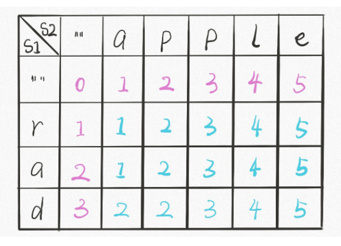
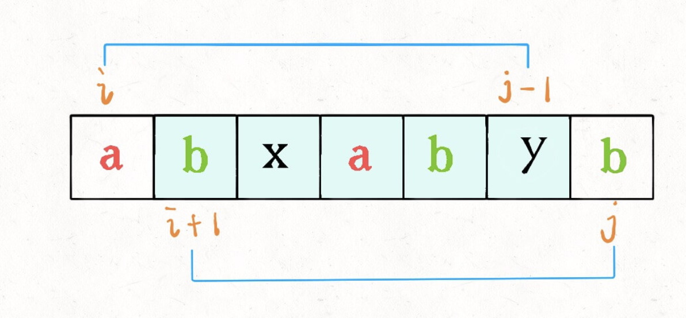
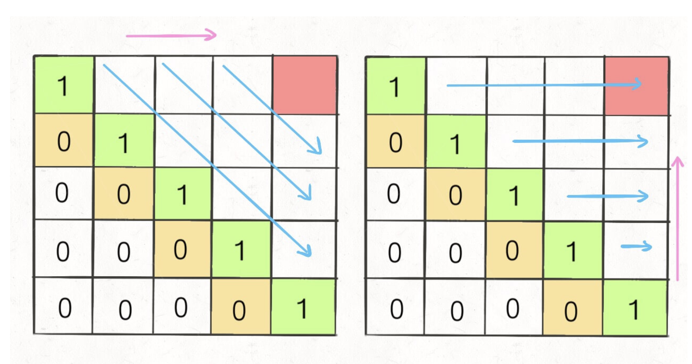
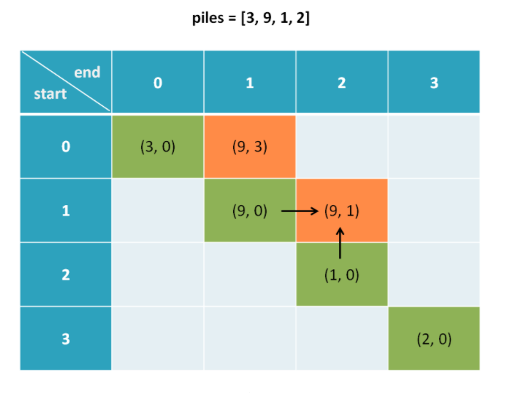
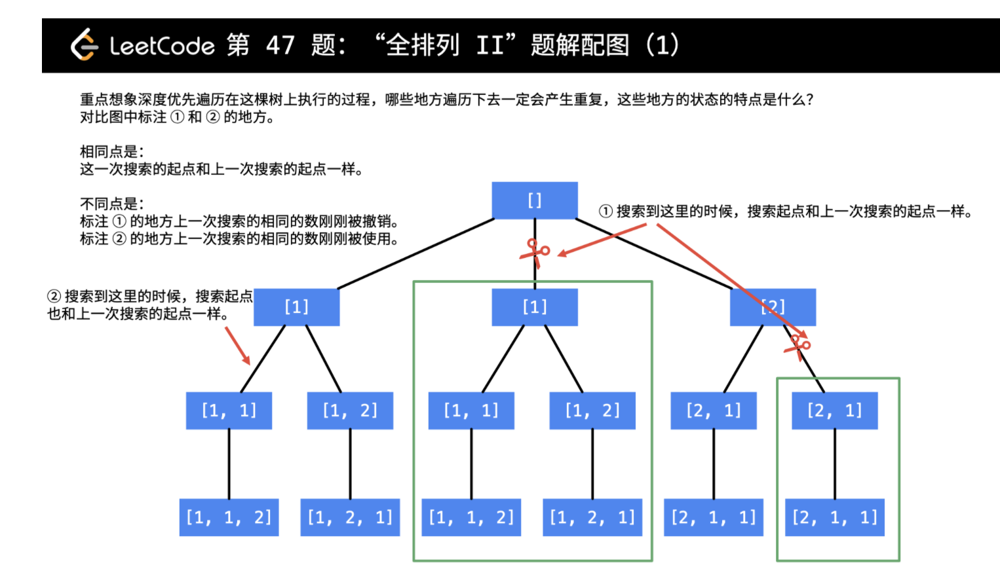
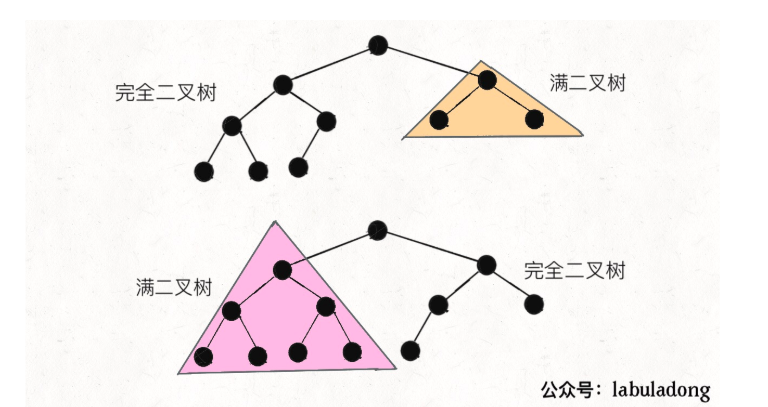
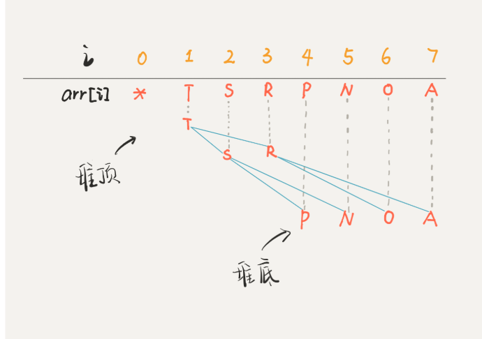

[toc]

# LeetCode学习笔记


## 1. 动态规划

### 1.1 动态规划解题框架

穷举存在重叠的子问题，比如某些递归过程中，产生了许多多余计算。

使用备忘录存储一些子问题的结果，可以是自顶向下的，也可以是由下向上的。

以找零钱问题为例子:

> 给你 `k` 种面值的硬币，面值分别为 `c1, c2 ... ck`，每种硬币的数量无限，再给一个总金额 `amount`，问你**最少**需要几枚硬币凑出这个金额，如果不可能凑出，算法返回 -1 

> **先确定「状态」**，也就是原问题和子问题中变化的变量。由于硬币数量无限，所以唯一的状态就是目标金额 `amount`。
>
> **然后确定** **`dp`** **函数的定义**：当前的目标金额是 `n`，至少需要 `dp(n)` 个硬币凑出该金额。
>
> **然后确定「选择」并择优**，也就是对于每个状态，可以做出什么选择改变当前状态。具体到这个问题，无论当的目标金额是多少，选择就是从面额列表 `coins` 中选择一个硬币，然后目标金额就会减少：
>
> **最后明确 base case**，显然目标金额为 0 时，所需硬币数量为 0；当目标金额小于 0 时，无解，返回 -1

```python
def coinChange(coins, amount):
    dp = [float('inf')] * (amount+1)
    dp[0] = 0
    for coin in coins:
        for x in range(coin, amount+1):
            dp[x] = min(dp[x], dp[x-coin]+1)
            
     return dp[amount] if dp[amount] != float('inf') else -1
      
```

### 1.2 最长递增子序列

子序列不一定是连续的，子串一定是连续的。

> 给定一个未排序的整数数组，找到最长递增子序列的长度。

定义dp[i]为截至索引i的最长递增子序列的长度

```python
def findMaxSeq(nums):
    
    dp = [1] * len(nums)
    
    for i in range(1,len(nums)):
        for j in range(i):
           if nums[i] > nums[j]:
              dp[i] = max(dp[j] + 1, dp[i])

     return max(dp)
```


变种：计算最长自增子串的长度。子串的话，就是连续的:[674. 最长连续递增序列](https://leetcode-cn.com/problems/longest-continuous-increasing-subsequence/)

```python
class Solution:
    def findLengthOfLCIS(self, nums: List[int]) -> int:
        n = len(nums)
        if not nums or n < 0:
            return 0
        dp = [1] * n

        for i in range(1, n):
            if nums[i] > nums[i - 1]:
                dp[i] = dp[i - 1] + 1

        return max(dp)
```

变种：[673. 最长递增子序列的个数](https://leetcode-cn.com/problems/number-of-longest-increasing-subsequence/)

> 给定一个未排序的整数数组，找到最长递增子序列的个数。
>
> 示例 1:
>
> 输入: [1,3,5,4,7]
> 输出: 2
> 解释: 有两个最长递增子序列，分别是 [1, 3, 4, 7] 和[1, 3, 5, 7]。

不仅需要计算递增子序列，还需要统计这样的递增子序列出现过多少次。因为有可能会有很多次。

+ 如果dp_length[i] 小于 dp_length[j]+1，那么说明第一次遇到他，对长度进行+1，同时出现次数与j处一样
+ 如果dp_length[i] 等于 dp_length[j]+1，那么说明前面已经有j出现过这种情况。那么此处的count继承j的count，进行累加

```python
class Solution:
    def findNumberOfLIS(self, nums: List[int]) -> int:
        n = len(nums)
        if n == 0: return 0
        dp_length = [1] * len(nums)
        dp_count = [1] * len(nums)

        for i in range(1, n):
            for j in range(i):
                if nums[i] > nums[j]:
                    if dp_length[j] + 1 > dp_length[i]:
                        # 如果第一次发现出现更大的数
                        dp_length[i] = dp_length[j] + 1
                        dp_count[i] = dp_count[j]
                    elif dp_length[j] + 1 == dp_length[i]:
                        # 如果不是第一次发现
                        dp_count[i] += dp_count[j]

        max_length = max(dp_length)
        return sum([dp_count[i] for i in range(n) if dp_length[i]==max_length])
```

### 1.3 0-1背包问题

> 给定一个宝宝可以承载W重量的物品，有N种物品，每一个重量和价值二元组 {w_i, v_i}，求出背包种的最大价值。注意物品的个数是无限的

解析：问题在于如何定义状态转移方程，定义 $dp[c][w]$ 为前c个物品，当前容量为w的时候，可以装的最大价值

```python
def myfunc(W,N,wt_list,val_list):
    dp = [0 for _ in range(W)] * N
    
    for i in range(1, N):
        for w in range(1, W):
            if w-wt_list[i] < 0:
                # 此时只能不放
                dp[i][w] = dp[i-1][w]
            else:
                dp[i][w] = max(dp[i-1][w], dp[i-1][w-wt_list[i-1]]+val_list[i])
    
```

### 1.4 编辑距离

> 给你两个单词 word1 和 word2，请你计算出将 word1 转换成 word2 所使用的最少操作数 。
>
> 你可以对一个单词进行如下三种操作：
>
> 插入一个字符
> 删除一个字符
> 替换一个字符

[72. 编辑距离](https://leetcode-cn.com/problems/edit-distance/)



```python
class Solution:
    def minDistance(self, word1: str, word2: str) -> int:
        m = len(word1)
        n = len(word2)
        if m == 0 or n == 0:
            return n + m

        dp = [[0 for _ in range(n+1)] for _ in range(m+1)]

        # base score
        dp[0] = [i for i in range(n+1)]
        
        for j in range(m+1):
            dp[j][0] = j


        for i in range(1, m+1):
            for j in range(1, n+1):
                if word1[i-1] == word2[j-1]:
                    dp[i][j] = dp[i-1][j-1]
                else:
                    dp[i][j] = min(dp[i-1][j]+1, dp[i][j-1]+1, dp[i-1][j-1]+1)

        return dp[m][n]
```

相关代码一道:[面试题 01.05. 一次编辑](https://leetcode-cn.com/problems/one-away-lcci/)

> 字符串有三种编辑操作:插入一个字符、删除一个字符或者替换一个字符。 给定两个字符串，编写一个函数判定它们是否只需要一次(或者零次)编辑。

```python
class Solution:
    def oneEditAway(self, first: str, second: str) -> bool:
        m = len(first)
        n = len(second)

        if m<n:
            first, second = second, first # 保证first更长
            m,n=n,m
        
        if m-n>1:
            # 如果相差超过1，不可能
            return False
        
        
        for i in range(n):
            if first[i] != second[i]:
                # 如果出现不一样了，看看是删除，还是修改可以成功
                return first[i+1:] == second[i+1:] or first[i+1:] == second[i:]
        
        return True # 其余情况
```

### 1.5 高楼摔鸡蛋

#### 1.5.1 普通解法

最坏情况下的，最少扔鸡蛋次数：最坏情况指的是最后一次鸡蛋才碎。最少扔鸡蛋次数指的是哪种策略更好。

定义N层楼，K个鸡蛋，最差需要m次。

$$dp[k][N]=min(res, max(dp[k][N-i], dp[k-1][i-1])+1)$$

+ 在第i层，如果鸡蛋碎了，去下一层扔
+ 如果没碎，去上一层扔


```python
def superEggDrop(K, N):
    memo = dict()
    def dp(K,N):
        if K==1:return N
        if N==0:return 0
        
        if (K,N) in memo:
            return memo([(K,N)])
        res = float('inf')
        for i in range(1, N+1):
            res = min(res, max(dp(K, N-i), dp(K-1, i-1))+1)
        memo[(K,N)] = res
        return res
    
    return dp(K,N)
```

#### 1.5.2 二分法减少时间复杂度

dp(K, N-i), dp(K-1, i-1)看做是i的函数，前者单调递减，后者单调递增。

因此所谓求取最大值的最小值，其实就是选取二者的交点。

```python
def superEggDrop(K, N):
    memo = dict()
    def dp(K,N):
        if K==1:return N
        if N==0:return 0
        
        if (K,N) in memo:
            return memo([(K,N)])
        res = float('inf')
        # 用二分法替代
        lo, hi = 1, N
        while lo <= hi:
            mid = (lo + hi) // 2
            broken = dp(K-1, mid-1)
            not_broken = dp(K, N-mid)
            
            if broken > not_broken:
                hi = mid - 1
                res = min(res, broken + 1)
             else:
                lo = mid + 1
                res = min(res, not_broken+1)
        
        memo[(K,N)] = res
        return res
    
    return dp(K,N)
```


#### 1.5.3 重新定义状态转移方程

定义$dp[k][m]=F$为k个鸡蛋，最多允许试错m次，可以达到最高的楼层。


```python
def superEggDrop(K,N):
    dp = [[0 for i in range(K+1)] for _ in range(N+1)]
    m = 0
    while dp[K][m] < N:
        m += 1
        for k in range(K+1):
            dp[k][m] = dp[k-1][m-1] + dp[k][m-1] + 1
     return m
```

同时可以只扫描一维列表，把m直接返回。

```python
class Solution:
    def superEggDrop(self, K: int, N: int) -> int:
        if K == 1:
            return N
        if N == 0:
            return 0

        dp = [0 for _ in range(K + 1)]

        m = 0

        while dp[K] < N:
            for k in range(K, 0, -1):
                dp[k] = dp[k] + dp[k - 1] + 1
            m += 1

        return m
```

### 1.6 最长公共子序列

[1143. 最长公共子序列](https://leetcode-cn.com/problems/longest-common-subsequence/)

当两个字符串当前指针位置所指字符相同时，子序列长度+1；假如不相等，就得看保留哪一个，得到的最长。

```python
class Solution:
    def longestCommonSubsequence(self, text1: str, text2: str) -> int:
        m = len(text1)
        n = len(text2)

        dp = [[0 for _ in range(n+1)] for _ in range(m+1)]

        for i in range(1, m+1):
            for j in range(1, n+1):
                if text1[i-1] == text2[j-1]:
                    dp[i][j] = dp[i-1][j-1]+1
                else:
                    dp[i][j] = max(dp[i-1][j], dp[i][j-1])

        return dp[m][n]
```

### 1.7 最长回文子序列

考虑子序列不一定是连续的，首先需要定义一个转移方程，



定义`dp[i][j]`为索引i到j的字符串最长回文子序列，假如i，j处字符相同，那么$dp[i][j]=dp[i+1][j-1]+2$,否则需要看哪一种情况下更大。



```python
class Solution:
    def longestPalindromeSubseq(self, s: str) -> int:
        n = len(s)
        if n < 1:
            return n
        
        dp = [[0]*n for _ in range(n)]

        for i in range(n):
            dp[i][i] = 1
        
        for i in range(n-2, -1, -1):
            for j in range(i+1, n, 1):
                if s[i] == s[j]:
                    dp[i][j] = dp[i+1][j-1] + 2
                else:
                    dp[i][j] = max(dp[i+1][j], dp[i][j-1])

        return dp[0][n-1]
```

### 1.8 博弈问题 —— 石子游戏

#### 1.8.1 石子游戏1——先后从最左和最右取石子

> 你和你的朋友面前有一排石头堆，用一个数组 piles 表示，piles[i] 表示第 i 堆石子有多少个。你们轮流拿石头，一次拿一堆，但是只能拿走最左边或者最右边的石头堆。所有石头被拿完后，谁拥有的石头多，谁获胜。

[877. 石子游戏](https://leetcode-cn.com/problems/stone-game/)

分析：每次拿石头的时候，只能选择从最左边或者最右边进行拿。定义dp数组为$dp[i][j]$为当石碓是以i索引开始，j索引结束时，我们可以得到的最优得分。先手和后手各有一个值。

base_score: 当只有一个石子的时候，先手得到$dp[i]$，后手得到0.

转移方程问题:

```shell
dp[i][j].first表示先手可以得到的最高分数，同理dp[i][j].second表示后者可以得到的最高分数;


每一次先手需要考虑的就是，取左边还是右边最佳。
取左边=左边的分数+剩余dp[i+1][j].second即后手得到的分数
取右边=右边的分数+剩余dp[i][j-1].second即后手得到的分数

而后手则是等先手选择后，取剩余石子堆最优。
```



```python
class Solution:
    def stoneGame(self, piles: List[int]) -> bool:
        n = len(piles)
        dp = [[Pairs(0, 0) for _ in range(n)] for _ in range(n)]

        for i in range(n):
            dp[i][i].fir, dp[i][i].sec = piles[i], 0

        for i in range(n - 2, -1, -1):
            for j in range(i + 1, n, 1):
                left_choice = piles[i] + dp[i + 1][j].sec
                right_choice = piles[j] + dp[i][j - 1].sec

                if left_choice >= right_choice:
                    dp[i][j].fir = left_choice
                    dp[i][j].sec = dp[i + 1][j].fir
                else:
                    dp[i][j].fir = right_choice
                    dp[i][j].sec = dp[i][j - 1].fir

        return dp[0][n-1].fir > dp[0][n-1].sec


class Pairs:

    def __init__(self, fir, sec):
        self.fir = fir
        self.sec = sec
```

#### 1.8.2 石子游戏2

[1140. 石子游戏 II](https://leetcode-cn.com/problems/stone-game-ii/)

+ 采用回溯方法

每次轮到自己拿石子的时候，要在后继的所有状态中，选择对自己有利的。定义$dfs(i,M)$为从第i堆开始取，最多允许拿$1\leq x\leq 2*M$的时候，可以拿到的最大值。

1. 如果$i\geq n$的时候，说明溢出了，返回0
2. 如果$i+2M \geq n$说明最后可以一把拿来，可以直接返回$sun(piles[i:])$
3. 如果不是这种情况，需要遍历$1\leq x\leq 2*M$种情况，求敌人最小化$dfs(i+x, max(x,M))$下，最多我们能拿多少。

```python
class Solution:
    def stoneGameII(self, piles: List[int]) -> int:
        n, memo = len(piles), dict()

        # 定义s[i]为第i堆石子到最后一堆石子的总石子数
        s = [0] * (n+1)
        for i in range(n - 1, -1, -1):
            s[i] = s[i + 1] + piles[i]

        def dfs(i, M):
            """定义从第i堆石子开始取，最多取M堆可以得到的最优值"""

            if (i, M) in memo:
                return memo[(i, M)]

            if i >= n:
                return 0
            if i + M * 2 >= n:
                return s[i]

            best = 0
            for x in range(1, M * 2 + 1):
                best = max(best, s[i] - dfs(i + x, max(x, M)))

            memo[(i, M)] = best
            return best

        return dfs(0, 1)

#Your runtime beats 66.04 % of python3 submissions
#Your memory usage beats 100 % of python3 submissions (14.1 MB)
```

#### 1.8.2 石子游戏3

[1406. 石子游戏 III](https://leetcode-cn.com/problems/stone-game-iii/)

有负数存在时, 要注意和第二题不同，可能最优的值小于0，因此best不能初始化为0

```python
# 参考石子游戏2
class Solution:
    def stoneGameIII(self, stoneValue: List[int]) -> str:

        n = len(stoneValue)
        memo = dict()

        # 以s[i]定义从i开始后续所有石子的得分总值
        s = [0] * (n+1)
        for i in range(n-1, -1, -1):
            s[i] = stoneValue[i] + s[i+1]


        def dfs(i):

            if i in memo:
                return memo[i]
            if i >= n:
                return 0
            
            res1 = s[i]-dfs(i+1)
            res2 = s[i]-dfs(i+2)
            res3 = s[i]-dfs(i+3)

            memo[i] = max(res1, res2, res3)
            return memo[i]
        
        alice = dfs(0)
        bob = s[0] - alice
        if alice > bob:return 'Alice'
        elif alice < bob:return 'Bob'
        else: return 'Tie'
```

参考网友版本:要想使得我们最高，只需要在后面+1，+2，+3的地方数值最小即可，就是留最少的东西给别人。同时此段代码在初始化的时候在dp末尾填上最大值，防止溢出报错。

```python
class Solution:
    def stoneGameIII(self, stoneValue: List[int]) -> str:

        n = len(stoneValue)
        dp = [0 for i in range(n+1)] + [1000]*4
        su = 0

        for i in range(n-1, -1, -1):
            su += stoneValue[i]
            res = min(dp[i+1], dp[i+2], dp[i+3])
            dp[i] = su - res

        if dp[0]+dp[0]<su:
            return "Bob"
        elif dp[0]+dp[0]>su:
            return "Alice"
        return "Tie"
```


## 2. 回溯算法

#### 2.1 回溯算法解题框架

回溯过程实际上就是一个决策树的遍历过程，主要包含：

+ 路径：已经做出的选择
+ 选择列表：当前还可以做的选择
+ 结束条件：到达决策树底层，无法再做选择的条件

```python
result = []
def backtrack(路径, 选择列表):
    if 满足结束条件:
        result.add(路径)
        return

    for 选择 in 选择列表:
        做选择
        backtrack(路径, 选择列表)
        撤销选择
```

#### 2.2 全排列问题

+ 普通排列问题：输出一个序列的所有排列

```python
def permute(nums):
    n = len(nums)
    flag = [0] * n
    result = []
    drawback(nums, [])
    return result
    
    def drawback(nums, path):
        if len(path) == n:
            result.append(path.copy())
            return
            
        for i, num in enumerate(nums):
            if flag[i]==0:
                flag[i]=1
                path.append(num)
                drawback(nums, path)
                path.pop()
                flag[i]=0
                
     
```

+ 全排列2：输出序列的一个排列，同时不能有重复的序列出现。

剪枝的时候，将与前一个元素相同，同时前一个元素刚刚撤销选择的进行剔除。



```python
class Solution:
    def permuteUnique(self, nums: List[int]) -> List[List[int]]:
        nums.sort()
        result = []
        flag = [0] * len(nums)

        def drawback(nums, path):
            if len(nums) == len(path):
                result.append(path.copy())
                return

            for i, num in enumerate(nums):
                if flag[i] == 1:
                    continue
                if num == nums[i - 1] and i > 0 and flag[i - 1] == 0:
                    continue

                path.append(num)
                flag[i] = 1
                drawback(nums, path)
                flag[i] = 0
                path.pop()

        drawback(nums, [])
        return result
```


#### 2.3  组合问题

找出1-n数组产生的组合数，树的剪枝条件是当前path长度等于k。

```python
class Solution:
    def combine(self, n: int, k: int) -> List[List[int]]:
        # 组合其实就是限制了树深的DFS
        result = []
        flag = [0] * n

        def drawback(n, k, start, path):
            if k == len(path):
                result.append(path.copy())
                return

            for i in range(start, n):
                if flag[i] == 1:
                    continue
                path.append(i + 1)
                flag[i] = 1
                drawback(n, k, i + 1, path)
                path.pop()
                flag[i] = 0

        drawback(n, k, 0, [])
        return result
```

+ 组合问题

```python
class Solution:
    def combinationSum(self, candidates: List[int], target: int) -> List[List[int]]:

        result = []
        candidates.sort()

        def drawback(candidates, start, target, path):
            if target == 0:
                result.append(path.copy())

            for i in range(start, len(candidates)):
                residus = target - candidates[i]
                if residus < 0:
                    break
                path.append(candidates[i])
                drawback(candidates, i, residus, path)
                path.pop()
        drawback(candidates, 0, target, [])
        return result
```


+ 组合问题2

```python
class Solution:
    def combinationSum2(self, candidates: List[int], target: int) -> List[List[int]]:
        result = []
        n = len(candidates)
        flag = [0] * n
        candidates.sort()

        def drawback(candidates, target, start, path):
            if target == 0:
                result.append(path.copy())
                return

            for i in range(start, n):
                if flag[i] == 1:
                    continue
                if i > 0 and candidates[i] == candidates[i - 1] and flag[i - 1] == 0:
                    continue
                residual = target - candidates[i]
                if residual < 0:
                    break
                path.append(candidates[i])
                flag[i] = 1
                drawback(candidates, residual, i + 1, path)
                path.pop()
                flag[i] = 0

        drawback(candidates, target, 0, [])
        return result

```


+ 组合问题3

```python
class Solution:
    def combinationSum3(self, k: int, n: int) -> List[List[int]]:
        result = []
        flag = [0] * 9

        def drawback(k, target, path, curr):
            if len(path) == k and target == 0:
                result.append(path.copy())
                return

            for i in range(curr, 9):
                residual = target - i - 1
                if residual < 0:
                    break
                flag[i] = 1
                path.append(i+1)
                drawback(k, residual, path, i+1)
                path.pop()
                flag[i] = 0

        drawback(k, n, [], 0)
        return result
```


+ 组合问题4

```python
class Solution:
    def combinationSum4(self, nums: List[int], target: int) -> int:
        # 类似零钱兑换问题
        if target <= 0:
            return 0
        dp = [0] * (target + 1)

        dp[0] = 1

        for i in range(target + 1):
            for num in nums:
                if i - num >= 0:
                    dp[i] += dp[i - num]

        return dp[target]
```


## 3. 二分查找

### 3.1 基础框架

```python
def BinarySearch(nums, target):
  left = 0
  right = ……
  
  while(……):
    mid = left + (right - left)/2
    if nums[mid] == target:
      ……
    elif nums[mid] < target:
      left = ……
    elif nums[mid] > target:
      right = ……
  
  return ……
```

如上`……`表示可能出现细节问题的地方。使用`left+(right-left)/2`是为了防止`left`和`right`太大直接相加导致溢出。

+ `while`的区间怎么写: `left  <= right`则是左闭右闭
+ 终止条件：找到的话，就返回。如果整个循环终止，还没有找到，就`return` -1
+ `left`和`right`更新：左闭右闭的话，就是`left=mid+1,right=mid-1`

### 3.2 算法缺陷

假如给定数组`nums=[1,2,2,2,3]`，`target=2`则此算法返回的索引是2，但如果想要返回左侧边界或者右侧边界都无法处理。

### 3.3 寻找左侧边界

```python
def BinarySearch(nums, target):
  left = 0
  right = len(nums)-1
  
  while(left <= right):
    mid = left + (right - left)/2
    if nums[mid] == target:
      right = mid - 1
    elif nums[mid] < target:
      left = mid + 1
    elif nums[mid] > target:
      right = mid - 1
  # 考虑边界问题
  if (left >= len(nums) or nums[left] != target):
    return -1
  return left
```

### 3.4 寻找右侧边界

```python
def BinarySearch(nums, target):
  left = 0
  right = len(nums)-1
  
  while(left <= right):
    mid = left + (right - left)/2
    if nums[mid] == target:
      left = mid + 1
    elif nums[mid] < target:
      left = mid + 1
    elif nums[mid] > target:
      right = mid - 1
  # 考虑边界问题
  if (right <= 0 or nums[right] != target):
    return -1
  return right
```

如上所述，边界问题都是target比nums的数都大，或者都小的情况。

### 3.5 相关题目

|                              题目                               |                      是否解决                      | 难度  |
| :-------------------------------------------------------------: | :------------------------------------------------: | :---: |
| [704.二分查找](https://leetcode-cn.com/problems/binary-search/) | [704.二分查找_solved_](./Leetcode/704.二分查找.py) | Easy  |


## 4. 滑动窗口解题套路框架


### 4.1 最小覆盖子串

[76.最小覆盖子串](https://leetcode-cn.com/problems/minimum-window-substring/)

> 给你一个字符串 S、一个字符串 T，请在字符串 S 里面找出：包含 T 所有字母的最小子串。
>
> 示例：
>
> 输入: S = "ADOBECODEBANC", T = "ABC"
> 输出: "BANC"
> 说明：
>
> 如果 S 中不存这样的子串，则返回空字符串 ""。
> 如果 S 中存在这样的子串，我们保证它是唯一的答案。

```Python
# 从字符串S中寻找包含T中所有字母的最小子串
# 从S中设置left,right，比较窗口中是否出现。都出现后，再逐渐缩小left。当又出现对应不上的时候，再右移right

from collections import Counter
class Solution:
    def minWindow(self, s: str, t: str) -> str:
        left, right, start = 0, 0, 0
        minLen = float('inf')
        needs = dict(Counter(t))
        window = {item: 0 for item in needs}
        match = 0

        while right < len(s):
            c1 = s[right]
            if c1 in needs:
                window[c1] += 1
                if window[c1] == needs[c1]:
                    # 如果出现次数对上了
                    match += 1
            #right += 1

            while match == len(needs):
                # 如果都找到了，需要把left移动了
                if minLen > right - left + 1:
                    start = left
                    minLen = right - left + 1
                c2 = s[left]
                if c2 in needs:
                    window[c2] -= 1
                    if window[c2] < needs[c2]:
                        match -= 1
                left += 1

            right += 1
        return "" if minLen == float('inf') else s[start:start+minLen]
```

### 4.2 找到字符串中所有字母异位词

[438. 找到字符串中所有字母异位词](https://leetcode-cn.com/problems/find-all-anagrams-in-a-string/)

> 给定一个字符串 s 和一个非空字符串 p，找到 s 中所有是 p 的字母异位词的子串，返回这些子串的起始索引。
>
> 字符串只包含小写英文字母，并且字符串 s 和 p 的长度都不超过 20100。
>
> 说明：
>
> 字母异位词指字母相同，但排列不同的字符串。
> 不考虑答案输出的顺序。
> 示例 1:
>
> 输入:
> s: "cbaebabacd" p: "abc"
>
> 输出:
> [0, 6]
>
> 解释:
> 起始索引等于 0 的子串是 "cba", 它是 "abc" 的字母异位词。
> 起始索引等于 6 的子串是 "bac", 它是 "abc" 的字母异位词。
>  示例 2:
>
> 输入:
> s: "abab" p: "ab"
>
> 输出:
> [0, 1, 2]
>
> 解释:
> 起始索引等于 0 的子串是 "ab", 它是 "ab" 的字母异位词。
> 起始索引等于 1 的子串是 "ba", 它是 "ab" 的字母异位词。
> 起始索引等于 2 的子串是 "ab", 它是 "ab" 的字母异位词。

```python
from collections import Counter


class Solution:
    def findAnagrams(self, s: str, p: str) -> List[int]:
        left, right, start = 0, 0, 0
        needs = dict(Counter(p))
        window = {item: 0 for item in needs}
        match = 0
        result = []

        while right < len(s):
            c1 = s[right]
            if c1 in needs:
                window[c1] += 1
                if window[c1] == needs[c1]:
                    # 如果出现次数对上了
                    match += 1
            #right += 1

            while match == len(needs):
                # 如果都找到了，需要把left移动了
                if len(p) == right - left + 1:
                    result.append(left)
                c2 = s[left]
                if c2 in needs:
                    window[c2] -= 1
                    if window[c2] < needs[c2]:
                        match -= 1
                left += 1

            right += 1
        return result
```

### 4.3 无重复的最长子串

[3. 无重复字符的最长子串](https://leetcode-cn.com/problems/longest-substring-without-repeating-characters/)

> 给定一个字符串，请你找出其中不含有重复字符的 最长子串 的长度。
>
> 示例 1:
>
> 输入: "abcabcbb"
> 输出: 3 
> 解释: 因为无重复字符的最长子串是 "abc"，所以其长度为 3。
> 示例 2:
>
> 输入: "bbbbb"
> 输出: 1
> 解释: 因为无重复字符的最长子串是 "b"，所以其长度为 1。
> 示例 3:
>
> 输入: "pwwkew"
> 输出: 3
> 解释: 因为无重复字符的最长子串是 "wke"，所以其长度为 3。
>      请注意，你的答案必须是 子串 的长度，"pwke" 是一个子序列，不是子串。

```python
class Solution:
    def lengthOfLongestSubstring(self, s: str) -> int:
        left, right = 0, 0
        result = 0
        needs = dict(Counter(s))
        window = {item: 0 for item in needs}

        while right < len(s):
            c1 = s[right]
            window[c1] += 1

            while window[c1] > 1:
                c2 = s[left]
                window[c2] -= 1
                left += 1

            result = max(result, right-left+1)

            right += 1
        return result
```

### 4.4 题目


## 5. 双指针

左右指针、快慢指针。前者主要解决链表中的问题，比如链表中是否有环；后者主要解决数组（字符串）的问题，比如二分查找。

### 5.1 快慢指针

#### 判断链表中是否有环

利用快慢指针，如果有环，则快指针和慢指针必定会遭遇

[141. 环形链表](https://leetcode-cn.com/problems/linked-list-cycle/)


```python
class Solution:
    def hasCycle(self, head: ListNode) -> bool:
        slow = head
        fast = head

        while fast and fast.next:
            slow = slow.next
            fast = fast.next.next

            if (fast == slow):
                return True

        return False
```

#### 已知链表中有环，返回这个环的起始位置

[142. 环形链表 II](https://leetcode-cn.com/problems/linked-list-cycle-ii/)

只需要在相遇后，让快慢指针中的任一个指向head，然后同速前进，再相遇的时候就是环的起点。

```python
class Solution:
    def detectCycle(self, head: ListNode) -> ListNode:
        slow = head
        fast = head

        while True:
            # 为了当没有环的时候跳出
            if not (fast and fast.next):
                return
            slow = slow.next
            fast = fast.next.next

            if slow == fast:
                break

        fast = head
        while slow != fast:
            slow = slow.next
            fast = fast.next

        return fast
```

#### 寻找链表的中点

[878.链表的中间结点](https://leetcode-cn.com/problems/middle-of-the-linked-list/)

```python
class Solution:
    def middleNode(self, head: ListNode) -> ListNode:
        slow, fast = head, head

        while fast and fast.next:
            slow = slow.next
            fast = fast.next.next

        return slow
```

####  寻找链表的倒数第k个元素

[19. 删除链表的倒数第N个节点](https://leetcode-cn.com/problems/remove-nth-node-from-end-of-list/)

先让快指针移动k步，之后两个指针一起，当快指针指向末尾的时候，慢指针恰好是倒数第k个链表节点。

```python
class Solution:
    def removeNthFromEnd(self, head: ListNode, n: int) -> ListNode:
        dummy = ListNode(-1)
        dummy.next = head
        slow, fast = dummy, dummy
        for i in range(n):
            fast = fast.next

        while fast.next:
            slow = slow.next
            fast = fast.next

        slow.next = slow.next.next
        return dummy.next
```

### 5.2 左右指针

#### 二分查找

```python
def binarySearch(nums, target):
  left = 0
  right = len(nums) - 1
  
  while left <= right:
    mid = left + (right-left) // 2
    if nums[mid] == target:
      return mid
    elif nums[mid] > target:
      right = mid - 1
    elif nums[mid] < target:
      left = mid + 1
      
   return -1
```

#### 两数之和

[167. 两数之和 II - 输入有序数组](https://leetcode-cn.com/problems/two-sum-ii-input-array-is-sorted/)

```python
class Solution:
    def twoSum(self, nums: List[int], target: int) -> List[int]:
        left = 0
        right = len(nums) - 1

        while left <= right:
            sum = nums[left] + nums[right]
            if sum == target:
                return [left, right]
            elif sum < target:
                left += 1
            elif sum > target:
                right -= 1
        return -1
```

#### 反转数组

```python
def reverse(nums):
  left = 0
  right = len(nums) - 1
  while left < right:
    nums[left], nums[right] = nums[right],nums[left]
    left += 1
    right -= 1
```


## 6. 二叉搜索树

二叉搜索树：一个二叉树中，任意一个结点大于其左子树节点，小于其右子树的节点。

### 6.1 判断一颗树是否是二叉搜索树

[98. 验证二叉搜索树](https://leetcode-cn.com/problems/validate-binary-search-tree/)

```python
class Solution:
    def isValidBST(self, root: TreeNode) -> bool:

        def helper(root, min, max):
            if not root:
                return True
            if min and root.val <= min.val:
                return False
            if max and root.val >= max.val:
                return False
            return helper(root.left, min, root) and helper(root.right, root, max)

        return helper(root, None, None)
```

### 6.2 在二叉搜索树里面搜索数字

因为二叉搜索树有大小顺序，所以只需要对半查找

[700. 二叉搜索树中的搜索](https://leetcode-cn.com/problems/search-in-a-binary-search-tree/)

```python
class Solution:
    def searchBST(self, root: TreeNode, val: int) -> TreeNode:
        if not root:
            return None
        if val == root.val:
            return root
        if val < root.val:
            return self.searchBST(root.left, val)
        if val > root.val:
            return self.searchBST(root.right, val)

```

### 6.3 在二叉搜索树中插入一个数

[701. 二叉搜索树中的插入操作](https://leetcode-cn.com/problems/insert-into-a-binary-search-tree/)

```python
class Solution:
    def insertIntoBST(self, root: TreeNode, val: int) -> TreeNode:
        if root is None:
            return TreeNode(val)
        if root.val < val:
            root.right = self.insertIntoBST(root.right, val)
        if root.val > val:
            root.left = self.insertIntoBST(root.left, val)

        return root
```

### 6.4 在二叉搜索树中删除一个数

删除的时候不能破坏二叉搜索树，返回的还得是一个二叉搜索树。

+ 假如目标值小于当前结点，就去左子树继续遍历去删除
+ 假如目标值大于当前结点，就去右子树继续遍历去删除
+ 假如目标值等于当前结点，若为叶子节点可以直接删除；但是若不是叶子节点，如果左孩子非空，那么要用中序遍历的后续节点替代它（即大于当前值的最小值）；若右孩子非空，那么要用中序遍历的前序节点替代它（即小于当前值的最大值）

[450. 删除二叉搜索树中的节点](https://leetcode-cn.com/problems/delete-node-in-a-bst/)

```python
class Solution:
    def deleteNode(self, root: TreeNode, key: int) -> TreeNode:

        def successor(cur):
            # 中序遍历的后续节点
            cur = cur.right
            while cur.left:
                cur = cur.left
            return cur

        def predecessor(cur):
            # 中序遍历的前序节点
            cur = cur.left
            while cur.right:
                cur = cur.right
            return cur

        def delete(cur, key):
            if not cur:
                return None
            if cur.val < key:
                cur.right = delete(cur.right, key)
            elif cur.val > key:
                cur.left = delete(cur.left, key)
            else:
                if not cur.left and not cur.right:
                    # 如果是叶子节点
                    cur = None
                elif cur.right:
                    cur.val = successor(cur).val
                    cur.right = delete(cur.right, cur.val)
                else:
                    cur.val = predecessor(cur).val
                    cur.left = delete(cur.left, cur.val)

            return cur

        return delete(root, key)
```

## 7. 如何计算完全二叉树的节点数

> 满二叉树：除叶子节点外，每一层上的所有节点都有两个子节点的二叉树。国内有时候将完美二叉树称为完美二叉树。
>
> 完全二叉树：深度为k的，有n个节点的二叉树，当且仅当每一个节点都与深度为k的满二叉树中编号从1到n的节点一一对应时。


```python
class Solution:
    def countNodes(self, root: TreeNode) -> int:
        hl, hr = 0, 0
        left, right = root, root

        while left:
            left = left.left
            hl += 1

        while right:
            right = right.right
            hr += 1

        if hl == hr:
            # 如果此次迭代左右子树高度一样，那么实际上是满二叉树
            return 2 ** hl - 1
        else:
            return 1 + self.countNodes(root.left) + self.countNodes(root.right)
```



一颗完全二叉树的两颗子树，至少有一个是满二叉树。因此每次递归的时候，有一半会遇到`hl==hr`的终止条件，不会递归下去。故此段代码的复杂度为$O(log N * logN)$

## 8. 二叉堆

二叉堆主要操作就两个，`sink`和`swim`, 主要应用有两个，一个是堆排序，一个是优先级队列。

二叉堆其实是一种特殊的完全二叉树，只不过存在数组里，一般的链表二叉树，我们操作的是指针，而在数组里，将数组索引作为指针。



最大堆： 每个节点都大于等于它的两个子节点

最小堆：每个节点都小于等于它的两个子节点


### 8. 1 优先级队列

优先级队列：当你插入或者删除元素的时候，元素会自动排序，底层原理就是二叉堆的操作。

+ swim和sink，上浮和下沉

插入和删除元素的时候，难免破坏堆的性质，这时候就需要通过这两个操作来恢复堆的性质。

```python
# 上浮
def swim(k):
    while k > 1 and k > parent(k):
        # 如果第k个元素比上层大，将k换上去
        parent(k), k = k, parent(k)
        
        
# 下沉
def sink(k):
    while left(k) <= N:
        # 不能沉入堆底
        older = left(k)
        # 如果右边节点存在，比一下大小
        if right(k) <= N and older < right(k):
        older = right(k)
      
        # 如果节点k比两个孩子都大，就不必下沉:
        if older < k: break
        # 否则进行交换
        older, k = k, older
```

+ insert方法：先把元素加到最后，然后把它上浮到正确的位置。$O(logK)$
+ delmax：先把堆顶元素A和堆底最后的元素B对调，然后删除A，再把B下沉到正确位置。$O(logK)$


### 8.2 设计Twitter —— 合并多个有序链表


## 9. 栈与队列

### 9.1 栈、队列的互相实现

[232. 用栈实现队列](https://leetcode-cn.com/problems/implement-queue-using-stacks/)

[225. 用队列实现栈](https://leetcode-cn.com/problems/implement-stack-using-queues/)

### 9.2 单调栈

单调栈使得每一次新元素入栈后，栈内的元素都保持有序。

#### 9.2.1 next greater elements

单调栈的应用不是很广泛，但是适用于一种典型的问题：下一个更大的元素。

> 给你一个数组 T = [73, 74, 75, 71, 69, 72, 76, 73]，这个数组存放的是近几天的天气气温（这气温是铁板烧？不是的，这里用的华氏度）。你返回一个数组，计算：对于每一天，你还要至少等多少天才能等到一个更暖和的气温；如果等不到那一天，填 0 。
>
> 举例：给你 T = [73, 74, 75, 71, 69, 72, 76, 73]，你返回 [1, 1, 4, 2, 1, 1, 0, 0]。
>
> 解释：第一天 73 华氏度，第二天 74 华氏度，比 73 大，所以对于第一天，只要等一天就能等到一个更暖和的气温。后面的同理。

```python
def myfunc(nums):
    stack = [] # 一个栈
    for i in range(len(nums)-1, -1, -1):
        while stack and nums[i] >= stack[-1]:
            stack.pop()
        ans[i] = 0 if not stack else len(stack)-i
        stack.append(i)
        
     return ans
```

#### 9.2.2 循环数组下一个最大值

有了环形属性之后，问题的难点在于这个Next的意义不仅仅是当前元素的右边了，有可能出现在当前元素的左边。

可以将原始数组翻倍，在后面再接一个原始数组。（假装这个数组翻倍了）

[2,1,2,4,3  ||   2,1,2,4,3]

[503. 下一个更大元素 II](https://leetcode-cn.com/problems/next-greater-element-ii/)

如下利用取余来得到相应数字

```python
class Solution:
    def nextGreaterElements(self, nums: List[int]) -> List[int]:
        n = len(nums)
        ans = [-1] * n
        stack = []

        for i in range(2*n - 1, -1, -1):
            while stack and nums[i % n] >= stack[-1]:
                stack.pop()
            ans[i % n] = -1 if not stack else stack[-1]
            stack.append(nums[i % n])

        return ans
```

#### 9.2.3 两个数组中下一个更大元素

[496. 下一个更大元素 I](https://leetcode-cn.com/problems/next-greater-element-i/)

> Nums1，nums2，求nums1各个元素对应在nums2中下一个更大的元素

与上面的区别在于用了两个数组，可能得考虑用哈希表来存储一下。

```python
class Solution:
    def nextGreaterElement(self, nums1: List[int], nums2: List[int]) -> List[int]:
        dict_nums1 = {}
        m, n = len(nums1), len(nums2)
        stack = []

        for i in range(n-1, -1, -1):
            while len(stack) != 0 and nums2[i] >= stack[-1]:
                stack.pop()
            dict_nums1[nums2[i]] = -1 if len(stack) == 0 else stack[-1]
            stack.append(nums2[i])

        return [dict_nums1[i] for i in nums1]
```


### 9.3 单调队列

[239. 滑动窗口最大值](https://leetcode-cn.com/problems/sliding-window-maximum/)

> 给定一个数组 *nums*，有一个大小为 *k* 的滑动窗口从数组的最左侧移动到数组的最右侧。你只可以看到在滑动窗口内的 *k* 个数字。滑动窗口每次只向右移动一位。
>
> 返回滑动窗口中的最大值。

```
输入: nums = [1,3,-1,-3,5,3,6,7], 和 k = 3
输出: [3,3,5,5,6,7]
```

定义一个单调队列类，每次移动窗口的时候，第k个元素进入window后判断前面的值是否比他小，如果小就没必要留下来了，直接压走弹出队列。直到遇到一个大的数（类似单调栈）时，停止。当窗口进行下一此移动的时候，需要判断当前窗口最左端是否为max，当然你可以直接判断，也可以看一下目前的队列首端是否为窗口最左端，如果正好是的，也可以放心去pop。否则不需要pop了，因为早已经被pop掉了。因此单调队列需要实现:

+ `push`: window右侧压入元素，将比他小的值都剔除
+ `max`:求当前window中的最大值，即队列首端元素
+ `pop`: 将window最多端元素剔除掉，假设这个值和队列首元素不一样，说明早就被淘汰了。否则，可以安心去pop。

```python
class Solution:
    def maxSlidingWindow(self, nums: List[int], k: int) -> List[int]:
        window = MonotonicQueue()
        res = []
        for i, num in enumerate(nums):
            if i < k - 1:
                window.push(num)
            else:
                window.push(num)
                res.append(window.max())
                window.pop(nums[i - k + 1])
        return res


class MonotonicQueue:

    def __init__(self):
        self.queue = deque()

    def push(self, x):
        while self.queue and self.queue[-1] < x:
            self.queue.pop()
        self.queue.append(x)

    def pop(self, x):
        if self.queue and self.queue[0] == x:
            self.queue.popleft()

    def max(self):
        return self.queue[0]
```

## 10. 链表

### 10.1 反转链表

将单链表进行反转，可以使用前后指针的方式，每次将curr指针的next指向pre指针。

#### 双指针方式

```python
class Solution:
    def reverseList(self, head: ListNode) -> ListNode:
        pre = None
        curr = head

        while curr:
            tmp = curr.next
            curr.next = pre
            pre = curr
            curr = tmp
        return pre
```

#### 递归方式

+ 翻转整个链表

  [206. 反转链表](https://leetcode-cn.com/problems/reverse-linked-list/)
  
  将单链表整个的翻转过来

```
1. base case: 单个节点的时候，返回头结点
2. 后续递归里，返回一个新的头结点last，而head变为了最后一个元素
```

```python
class Solution:
    def reverseList(self, head: ListNode) -> ListNode:
        if not head or head.next is None:
            return head
        last = self.reverseList(head.next)
        head.next.next = head
        head.next = None
        return last
```

+ 翻转链表的前N个节点

```python
def reverseList(head,n):
  if not head or not head.next:
    return head
  if n==1:
    return head
  last = reverseList(head.next, n-1)
  successor = head.next.next
  head.next.next = head
  head.next =successor
  return last
```

+ 翻转链表的某个区间

```python
class Solution:
    def reverseBetween(self, head: ListNode, m: int, n: int) -> ListNode:
        def reverseN(head, n):
            if n == 1:
                return head
            last = reverseN(head.next, n - 1)
            successor = head.next.next
            head.next.next = head
            head.next = successor
            return last

        if m == 1:
            return reverseN(head, n)
        head.next = self.reverseBetween(head.next, m - 1, n - 1)
        return head
```

非递归方式:

```python
class Solution:
    def reverseBetween(self, head: ListNode, m: int, n: int) -> ListNode:
        dummy = ListNode(-1)
        dummy.next = head
        pre = dummy

        for i in range(m - 1):
            pre = pre.next

        start = pre.next
        tail = start.next  # 待变动插入的节点

        for i in range(n - m):
            start.next = tail.next
            tail.next = pre.next
            pre.next = tail
            tail = start.next
        return dummy.next
```

### 10.2 旋转链表

[61. 旋转链表](https://leetcode-cn.com/problems/rotate-list/)

> 给定一个链表，旋转链表，将链表每个节点向右移动 *k* 个位置，其中 *k* 是非负数。

```python
class Solution:
    def rotateRight(self, head: ListNode, k: int) -> ListNode:
        # 首先计算一下链表的长度
        def length(head):
            l = 0
            while head:
                head = head.next
                l += 1
            return l

        if not head or not head.next:
            return head

        # 真实需要移动的次数
        l = length(head)
        cnt = k % l

        cur = head
        for i in range(l - cnt - 1):
            cur = cur.next

        tail = cur
        while tail.next:
            tail = tail.next

        tail.next = head
        head = cur.next
        cur.next = None

        return head
```

### 10.3 两两交换链表中的节点

+ 1->2->3->4
+ head -> 2 -> 1 -> 3 -> 4

```python
class Solution:
    def swapPairs(self, head: Optional[ListNode]) -> Optional[ListNode]:
        dummy = ListNode(next=head)
        pre = dummy

        while pre.next and pre.next.next:
            cur = pre.next
            post = cur.next

            cur.next = post.next
            post.next = cur
            pre.next = post

            pre = pre.next.next
        return dummy.next
```


## 11.重复数字

查找列表中重复数字，多种不同要求下对应不同解法

### 11.1 找出任意一组重复数字

[剑指 Offer 03. 数组中重复的数字](https://leetcode.cn/problems/shu-zu-zhong-zhong-fu-de-shu-zi-lcof/)

```python
# 利用数组交换来定位重复数字
class Solution:
    def findRepeatNumber(self, nums: List[int]) -> int:
        for i in range(len(nums)):
            while nums[i] != i:
                index = nums[i]
                if nums[index] == index:
                    return index

                tmp = nums[i]
                nums[i] = nums[index]
                nums[index] = tmp
```

### 11.2 只有一个重复数字，用O(1)空间复杂度解决

[287. 寻找重复数](https://leetcode.cn/problems/find-the-duplicate-number/)

```python
# 二分查找方式:1~n多次二分，如果大于等于mid的元素个数大于mid，说明重复的数比mid要小，继续二分
class Solution:
    def findDuplicate(self, nums: List[int]) -> int:
        start = 0
        end = len(nums) - 1
        while end > start:
            mid = (end + start) // 2
            c = sum([1 for i in nums if i <= mid])
            if c > mid:
                end = mid
            else:
                start = mid + 1
        
        return start
    
# 快慢指针：是否有重复 等价于 链表是否有环；
class Solution:
    def findDuplicate(self, nums: List[int]) -> int:
        # 快慢指针
        slow,fast = 0, 0

        while True:
            slow = nums[slow]
            fast = nums[nums[fast]]

            if slow == fast:
                break

        fast = 0
        while slow != fast:
            slow = nums[slow]
            fast = nums[fast]

        return slow
```


### 11.3 输出所有重复数字的集合

[442. 数组中重复的数据](https://leetcode.cn/problems/find-all-duplicates-in-an-array/)

```python
class Solution:
    def findDuplicates(self, nums: List[int]) -> List[int]:
        for i in range(len(nums)):
            while nums[i] != nums[nums[i]-1]:
                nums[nums[i]-1], nums[i]  = nums[i], nums[nums[i]-1]

        return [value for i, value in enumerate(nums) if value -1 != i]

```


## 附录

| 类型               | 题目列表                                                                                                                                                                                                                                                                                                                                                                  | 备注 |
| :----------------- | ------------------------------------------------------------------------------------------------------------------------------------------------------------------------------------------------------------------------------------------------------------------------------------------------------------------------------------------------------------------------- | ---- |
| 二分查找           | [704. 二分查找](https://leetcode.cn/problems/binary-search/) [374. 猜数字大小](https://leetcode.cn/problems/guess-number-higher-or-lower/) [35. 搜索插入位置 ](https://leetcode.cn/problems/search-insert-position/) [278. 第一个错误的版本](https://leetcode.cn/problems/first-bad-version/) [367. 有效的完全平方数](https://leetcode.cn/problems/valid-perfect-square/) | √    |
|                    | [69. x 的平方根 ](https://leetcode.cn/problems/sqrtx/) , [367. 有效的完全平方数](https://leetcode.cn/problems/valid-perfect-square/), [441. 排列硬币](https://leetcode.cn/problems/arranging-coins/)                                                                                                                                                                      | √    |
| 二分查找应用(中等) | [34. 在排序数组中查找元素的第一个和最后一个位置](https:/leetcode.cn/problems/find-first-and-last-position-of-element-in-sorted-array/) , [540. 有序数组中的单一元素 ](https://leetcode.cn/problems/single-element-in-a-sorted-array/),[275. H 指数 II](https://leetcode.cn/problems/h-index-ii/) , [436. 寻找右区间](https://leetcode.cn/problems/find-right-interval/)   | √    |
|                    | [300](https://leetcode.cn/problems/longest-increasing-subsequence/)、[354](https://leetcode.cn/problems/russian-doll-envelopes/)、[658](https://leetcode.cn/problems/find-k-closest-elements/)、[162](https://leetcode.cn/problems/find-peak-element/)、[4](https://leetcode.cn/problems/median-of-two-sorted-arrays/)                                                    |      |
| 二分查找与旋转数组 | [153](https://leetcode.cn/problems/find-minimum-in-rotated-sorted-array/) [154](https://leetcode.cn/problems/find-minimum-in-rotated-sorted-array-ii/)、[33](https://leetcode.cn/problems/search-in-rotated-sorted-array/)、[81](https://leetcode.cn/problems/search-in-rotated-sorted-array-ii/)                                                                         |      |
| 二分查找与矩阵     | [74](https://leetcode.cn/problems/search-a-2d-matrix/)、[240](https://leetcode.cn/problems/search-a-2d-matrix-ii/)                                                                                                                                                                                                                                                        |      |
| 二分答案法         | [378](https://leetcode.cn/problems/kth-smallest-element-in-a-sorted-matrix/)、[668](https://leetcode.cn/problems/kth-smallest-number-in-multiplication-table/)、[410](https://leetcode.cn/problems/split-array-largest-sum/)、[483](https://leetcode.cn/problems/smallest-good-base/)                                                                                     |      |


