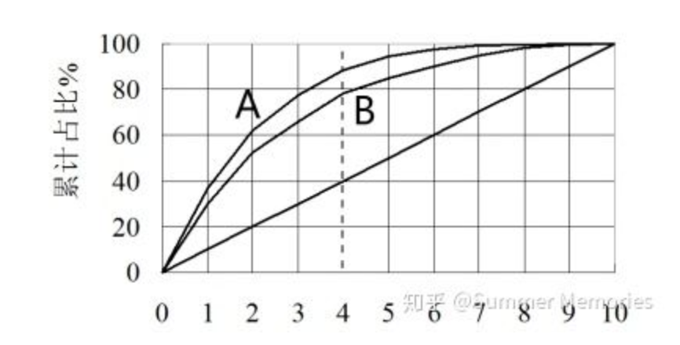

### 提升图与洛伦兹曲线

如果目前有10000个样本，坏用户占比为30%，我们做一个评分卡（分数越低，用户坏的概率越高），按照评分从低到高划分为10等份（每个等份用户数为1000），计算每等份坏用户占比，如果评分卡效果够好，那么越靠前的等份里，包含的坏用户应该越多，越靠后的等份里，包含的坏用户应该要更少。作为对比，如果不对用户评分，按照总体坏用户占比30%来算，每个等份中30%，将两种方法的每等份坏用户占比放在一张柱状图上进行对比，就是提升图。

将这两种方法的累积坏用户占比放在一张曲线图上，就是洛伦兹曲线图。洛伦兹曲线，可以比较两个评分卡的优势，

A，B模型虽然在虚线处的cutoff的拒绝率都是40%，但是A都能拒绝掉88%的坏用户，B只能拒绝掉78%的坏用户。

### WOE分析

1）WOE变化趋势
这个趋势变化主要针对连续数值型变量，假设WOE的计算方式是bad/good，某个变量按照业务理解是值越大，坏用户概率越大。那么变量分箱后，WOE的变化趋势应该与实际的业务经验一致，也就是变量的值越大，WOE越大，且呈单调性变化。对于WOE没有呈单调性变化的变量（例如U型或倒U型），如果业务上能解释的通，那也可以采用该变量。WOE呈波浪形变化的变量建议不采用。
PS：在做WOE趋势分析时不考虑缺失的箱体，并且最好将变量分为4-8箱。

2）箱体之间WOE的差异分析
分箱的原则是组内差异小，组间差异大，所以箱体之间的WOE要有显著差异，个人认为WOE的差值至少要在0.1以上，这样每个箱体的好坏比才有区别。另外我觉得WOE最好不要出现跃阶式变化，例如第一个箱体的woe是0.1，下一个箱体WOE直接增大到0.9，这样会导致最后转化的分数也会呈跃阶式变化，这个对总体评分的分布及稳定性会有很大影响。箱体的WOE最好是单调线性变化的。

3）箱体的WOE绝对值大小
箱体的WOE值最好是在-1至1之间，如果WOE的绝对值大于1，说明这个箱体的坏用户占比或者好用户占比在65%以上，这种变量适合做单条策略，如果放到模型中，这个变量的权重可能会很大，会增加模型过拟合的危险，并会影响评分卡的稳定性。

### SCORE分析
score就是每个变量各个区间对应的得分，根据score的计算公式（score=系数xWOEx刻度B），score的值和WOE的关系是很大的，所以和WOE分析类似，score也要分析它的趋势变化，箱体间score的差异，以及score的绝对值大小。分析逻辑与WOE大致相同。这里就不再说明。一般来说WOE的可解释性较好，score应该不会有大问题。

