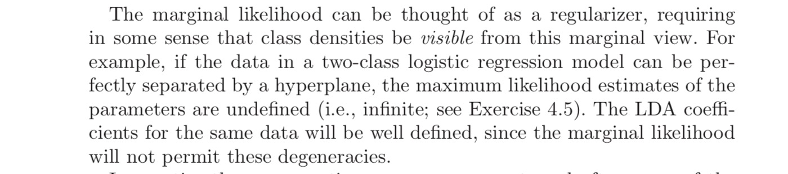

[TOC]

## 线性模型

### 最小二乘

对于线性回归问题，定义损失函数为平方函数时，产生的优化问题:
$$
arg \underset{\beta}{min} \sum (Y-X\beta)^{T}(Y-X\beta)
$$
可以考虑使用梯度下降法来求解；

在做梯度下降前，需要进行**归一化(标准化)**:
+ 提升模型的收敛速度，避免因为量纲不同而产生之字形的下降路线
+ 减少量纲的影响

求矩阵微商，即最优解应当是:
$$
\frac{\delta f}{\delta \beta} = 2X(X\beta - Y)=0
\\
故\hat{\beta}=(X^{T}X)^{-1}X^T y
$$

### 带正则项的最小二乘

由于$X^TX$不一定是满秩矩阵，因此常考虑引入正则项，即L1正则化或者L2正则化：
$$
arg \underset{\beta}{min} \sum (Y-X\beta)^{T}(Y-X\beta)+ \lambda ||\beta||_2^2
$$

## 广义线性模型

### 连接函数

> 广义线性模型的定义，对于单调可微的函数$g(·)$,则以下模型称为广义线性模型，其中$g(·)$称为连接函数。
> $$
> g(y)= \omega^Tx+b
> $$
>

### logistic 模型

> 阶跃函数：最早的思路是使用阶跃函数作为连接函数来解决2分类问题，然而阶跃函数不可微。

#### 为什么使用logistic function作为连接函数

+ 从指数族分布说起

  指数族分布满足下面的公式:
  $$
  p(y,\eta) = b(y)exp\{\eta T(y)-a(\eta)\}\\
  其中T(y)是充分统计量
  $$

对于二分类问题，假设y服从伯努利分布，事实上伯努利分布是指数族分布的一种:
$$
\begin{align}
p(y|\theta) &=  \theta^y(1-\theta)^{(1-y)} \\
&=exp(yln\theta+(1-y)ln(1-\theta))\\
&=exp(ln(\frac{\theta}{1-\theta})y+ln(1-\theta))
\end{align}
$$
如上所述，令
$$
\eta=ln(\frac {\theta}{1-\theta}),   则\    \theta=\frac{1}{1+e^{-\eta}}\\
$$
则
$$
E(y|x,\theta)=\theta=p(y=1|X)=\frac{1}{1+e^{-\omega^Tx}}
$$
值得注意的是，$p(y=1|x)$就等于y的期望，自然而然地，比值比:
$$
log_{ratio} = ln\frac{p(y=1|x)}{p(y=0|x)}=\omega^Tx
$$

+ 从贝叶斯角度:

  机器学习模型的精度上界就是最大化后验概率，使用sigmoid函数也是为了逼近最大后验概率
  $$
  p(y=1|x)=\frac{p(x|y=1)p(y=1)}{p(x|y=1)p(y=1)+ p(x|y=0)p(y=0)}\\
  假设先验分布为伯努利，条件似然为高斯分布，则\\
  p(y=1)=\phi, p(y=0)=1-\phi\\
  p(x|y=1) = \frac{1}{(2pi)^{n/2}|\Sigma|^{1/2}}exp(-(x-\mu)^T\Sigma^{-1}(x-\mu))\\
  以上代入上式，有
  $$

$$
\begin{align}
p(y=1|x) & =\frac{1}{1+\frac{p(x|y=0)p(y=0)}{p(x|y=1)p(y=1)}}\\
& = \frac{1}{1+exp(-a)}\\
其中a & = ln(\frac {p(x|y=1)p(y=1)}{p(x|y=0)p(y=0)}
\end{align}
$$

因此可以看出后验概率依旧为sigmoid函数的形式。从贝叶斯的角度来分析，取共轭先验更容易收敛到其后验分布。

+ 最大熵模型: 

+ 在所有的概率模型中，熵最大的模型是最好的模型。

  > 在没有更多信息的情况下，那些不确定的部分都是等可能的，这样熵最大。

最大熵模型中的对偶函数极大化 等价于 最大熵模型的极大似然估计；
$$
P_w(y|x)=\frac{exp(\sum_i^n w_if_i(x,y))}{\sum_yexp(\sum_i^n w_if_i(x,y))}
$$
使用sigmoid函数正是实现了最大熵原理。

#### 过程推导

+ 似然函数最大化：

$$
P(Y=1|X)=\frac{1}{1+e{-X^T\beta}}=1-P(Y=0|X)
$$

因此，有
$$
ln \frac{\pi}{1-\pi}=z=X^T\beta\\

L=\prod_i \pi_i^{y_i}{(1-\pi_i)}^{1-y_i}
$$
对数似然函数为:

$$
ln L = \sum_i [y_iln(\pi_i) + (1-y_i)ln(1-\pi_i)] \\ = \sum_i [y_iln(\frac{\pi_i}{1-\pi_i}) + ln(1-\pi_i)] \\ = \sum_i [y_i\beta^T X^{(i)}-ln(1+exp(\beta^T X^{(i)}))]
$$
求极大值(梯度下降法) :
$$
\mbox{每一步更新的过程}：\beta_{n+1} = \beta_n - \eta \frac{\delta L}{\delta\beta}
$$

+ **损失函数最小化**

   logistic的损失函数为对数损失函数(对数似然损失函数)，即$$L(Y,P(Y|X))=-logP(Y|X)$$,    即同样可以推出，等价于对数似然函数最小化，等价于上面的似然函数最大化：
$$
-ylog\pi-(1-y)log(1-\pi)
$$

+ 向量形式求导，有
  $$
  \begin{align}
  \frac{\partial L}{\partial \beta_j} & =x_j^{(i)}\sum_i [y_i-\frac{x_j^{(i)}exp\{\beta^TX\}}{1+exp\{\beta^TX\}}]\\
  &=x_j^{(i)}\sum_i [y_i-P(Y=1|X)]
  \end{align}
  $$

+ 矩阵形式:
  $$
  \frac {\partial L}{\partial \beta} =x^{(i)}\sum_i [y_i-P(Y=1|X)]
  $$

#### 类别不平衡

由于现实中很多数据中正负样本的比例不同，因此需要考虑上采样或者下采样。

由于y可以理解为概率$$\frac{y}{1-y}>1$$时，判为正例,但由于类别不平衡，考虑
$$
\frac{y}{1-y}>\frac{m+}{m-}
$$
可以理解为一个scaling的过程

#### 总结

+ logistic模型对数据的分布没有假设，同时分类的输出有预测概率，且由于凸函数各阶微分均有，许多优化算法均可使用。

####  为什么要把特征离散化

> 在工业界，很少直接将连续值作为逻辑回归模型的特征输入，而是将连续特征离散化为一系列0、1特征交给逻辑回归模型，这样做的优势有以下几点：
>
> 1. 离散特征的增加和减少都很容易，易于模型的快速迭代；
> 2. 稀疏向量内积乘法运算速度快，计算结果方便存储，容易扩展；
> 3. 离散化后的特征对异常数据有很强的鲁棒性：比如一个特征是年龄>30是1，否则0。如果特征没有离散化，一个异常数据“年龄300岁”会给模型造成很大的干扰；
> 4. 逻辑回归属于广义线性模型，表达能力受限；单变量离散化为N个后，每个变量有单独的权重，相当于为模型引入了非线性，能够提升模型表达能力，加大拟合；
> 5. 离散化后可以进行特征交叉，由M+N个变量变为M*N个变量，进一步引入非线性，提升表达能力；
> 6. 特征离散化后，模型会更稳定，比如如果对用户年龄离散化，20-30作为一个区间，不会因为一个用户年龄长了一岁就变成一个完全不同的人。当然处于区间相邻处的样本会刚好相反，所以怎么划分区间是门学问；
> 7. 特征离散化以后，起到了简化了逻辑回归模型的作用，降低了模型过拟合的风险。
>
> 李沐曾经说过：模型是使用离散特征还是连续特征，其实是一个“海量离散特征+简单模型” 同 “少量连续特征+复杂模型”的权衡。既可以离散化用线性模型，也可以用连续特征加深度学习。就看是喜欢折腾特征还是折腾模型了。通常来说，前者容易，而且可以n个人一起并行做，有成功经验；后者目前看很赞，能走多远还须拭目以待。

==关于离散特征交叉，连续型特征离散化==

+ 离散化：one-hot encoding;这样特征数目也得到了上升
+ 特征交叉：如一个特征处本来为1表示，之后可以使用0.5表示这个特征下的广告CTR。
+ 连续特征离散化：根据区间进行划分

> [参考网上的下段话](http://blog.csdn.net/lujiandong1/article/details/52412123)
>
> + 等频离散化需要对原有的每个特征都做，也就是原来的编号为1到13的编号，会离散化成很多的编号，如果每个特征离散化成10个，则最终会有130个特征，训练的结果w就会是一个130维的向量，分别对应着130个特征的权重。
> + 实际的应用表明，离散化的特征能拟合数据中的非线性关系，取得比原有的连续特征更好的效果，而且在线上应用时，无需做乘法运算，也加快了计算ctr的速度。

### LDA线性判别分析

### 为什么是线性的分界线

+ LDA假设协方差矩阵相同

LDA是Fisher判别的特殊情况，LDA假设样本协方差阵相同且满秩。

假设需要判定样本x属于两个类$k$与$l$中的哪一个，实际上是在比较二者的后验概率，即:
$$
\begin{align}
log\frac{p(G=k|X=x)}{p(G=l|X=x)} & = log\frac{f_k}{f_l}+log\frac{\pi_k}{\pi_l}\\
&=log\frac{\pi_k}{\pi_l}- \frac{1}{2}\{ (x-\mu_k)^T\Sigma^{-1}(x-\mu_k) -(x-\mu_l)^T\Sigma^{-1}(x-\mu_l) \}\\
&=log\frac{\pi_k}{\pi_l}-\frac{1}{2}(\mu_k+\mu_l)^T\Sigma^{-1}(\mu_k-\mu_l)+x^T\Sigma^{-1}(\mu_k-\mu_l)
\end{align}
\\此处假设均满足多元正态分布,且协方差矩阵相同
$$
因此，上述结果其实就是一个关于x的超平面，比值大于0分配给k，否则分配给l。

即，线性判别函数为:
$$
\delta_k(x)=log\pi_k+x^T\Sigma^{-1}\mu_k-\frac{1}{2}\mu_k^T\Sigma^{-1}\mu_k
$$
综上，分类即转化为$arg max \delta_k$的过程。

==实质上，若两类数据同先验，满足高斯分布，且协方差相同，LDA可以达到最优分类==

+ 当协方差矩阵不相同的时候

  此时，分类判别函数转化为一个二次函数,变为QDA:
  $$
  \delta_k(x) = -\frac{1}{2}log|\Sigma_k|-\frac{1}{2}(x-\mu_k)^T\Sigma_k^{-1}(x-\mu_k)+log\pi_k
  $$

### 核心思想

考虑将样本投影到一条直线上，同类的投影点尽可能地近，异类的投影点尽可能地远。
$$
若这条直线是\omega, 两类的均值，协方差分别为\mu_0,\mu_1, \Sigma_0,\Sigma_1\\
构造评价指标为(尽可能大) ,两类投影中心点之间的距离尽可能大，同类的协方差D(\omega^Tx)=\omega^Tx\omega尽可能小:\\
\begin{align}
J&=\frac{||W^T\mu_0-W^T\mu_1||_2^2}{W^T\Sigma_0W+W^T\Sigma_1W}\\&=\frac{W^T(\mu_0-\mu_1)(\mu_0-\mu_1)^TW}{W^T(\Sigma_0+\Sigma_1)W}\\
&=\frac{W^TS_bW}{W^TS_wW}\\
S_b表示组间离差阵，S_W表示组内离差阵
\end{align}
$$
以上的最大化可以使用拉格朗日乘数定理(由于若W是一个解，则kW也是一个解，不妨设$W^TS_wW=1$)
$$
\underset{w}{min} - w^TS_bw \ s.t. w^TS_ww=1\\即S_bw=\lambda S_ww
$$
由于$$S_bw=(\mu_0-\mu_1)^Tw(\mu_0-\mu_1)=k(\mu_0-\mu_1)\\始终在(\mu_0-\mu_1)方向上,因此可有 w=S_w^{-1}(\mu_0-\mu_1)$$

实践中，常常对$S_w^{-1}$进行奇异值分解；

### 推广到多分类

全局离散矩阵 $S_t=S_b+S_w=\sum_i^m(x_i-\mu_i)(x_i-\mu_i)^T$，其中

$S_w=\sum_i^NS_{wi}$ 常用的一种优化目标是:
$$
\underset{W}{max}\frac{tr(WTS_bW)}{tr(WTS_wW)}\\
这个问题求解可以用广义特征值问题来求解：

S_bW=\lambda S_wW
$$
$\omega$闭式解是$S_w^{-1}S_b$的$N-1$个最大广义特征值所对应的特征向量组成的矩阵。

如果把$\omega$看作是投影矩阵，则其将样本投影到N-1维度空间。此处的N是分类的个数，因此LDA也可以作为降维的一个手段，且是一种监督降维技术。

### logistic模型与LDA的联系与区别

对数后验比值比为一个关于X的线性函数,而logistic模型也是下式的形式:
$$
\begin{align}
log\frac{p(G=k|X=x)}{p(G=l|X=x)} 
&=log\frac{\pi_k}{\pi_l}-\frac{1}{2}(\mu_k+\mu_l)^T\Sigma^{-1}(\mu_k-\mu_l)+x^T\Sigma^{-1}(\mu_k-\mu_l)\\
&=\alpha+\beta^Tx
\end{align}
$$

+ logistic模型对density的假设更松，即计算过程中最大化==条件似然函数==(也可认为先验的极大似然估计为1/N,即与来自任何分布无关)

  而LDA最大化全似然函数，且最后的估计与假设的分布的参数有关。

  假设分布是高斯，即我们拥有了额外的参数信息，这会带来什么?

  (Efron 1975)指出在估计时，错误率会下降30%；因此，logistic模型可能多需要30%的数据达到相同效果。

+ LDA对outlier敏感

  LDA对于boundary之外的outlier不robust，因为该样本点在计算离差阵的时候有贡献。

- [x] 条件似然最大化的缺陷

## 分离超平面——从感知机说起

对于二分类问题，最小二乘法及LDA得到的线性分界线不一定是最优的，类似于感知器这类的模型产生如下的分离超平面:
$$
\beta_0 + \beta_1 x_1+\beta_2x_2=0
$$

### 思路

感知器的思想是最小化误分类样本的总距离。定义$M$为所有误分类样本的集合，即最小化:
$$
D(\beta, \beta_0)=-\sum_{i\in M}y_i(x_i^T\beta+\beta_0)\\
分离超平面为 \beta_0+\beta^Tx=0
$$
训练过程中使用随机梯度下降法:
$$
\frac{\partial D}{\partial\beta}=-\sum_{i\in M}y_ix_i\\
\frac{\partial D}{\partial\beta_0}=-\sum_{i\in M}y_i
$$

> 1 . 初始化$\beta_0$ , $\beta$
>
> 2.  随机梯度下降:
>
>    $$\beta_0 \leftarrow \beta_0 + \eta y_i, \beta\leftarrow \beta + \eta x_iy_i$$
>
> 3. 重复上述过程，直至达到终止条件

### 收敛性

[Novikoff定理]  感知器算法一定是可以收敛的:误分类的次数$k$有上界

定义$R=\underset{1\leq i\leq N}{max}||x_i||$,存在$\gamma>0$，使得$y_i(\omega_{opt}x_i)\geq \gamma$,且有 $k \leq (\frac R \gamma)^2$,证明:
$$
(1) 令 \gamma = min \{y_i(\omega_{opt}x_i+b_{opt})\},则得证
\\(2) 对于第k个误分类的样本,有:  \omega_k = \omega_{k-1} + \eta y_i x_i, \   b_k = b_{k-1}+\eta y_i
\\ 
\begin{align}
有\omega_k \cdot \omega_{opt} &= \omega_{k-1}\cdot \omega_{opt} +   \eta \omega_{opt}y_ix_i \\
& \geq \omega_{k-1}\cdot \omega_{opt} + \gamma \eta\\
& \geq \ldots \geq k\eta \gamma
\end{align}
$$

$$
\begin{align}
||\omega_k||^2 &= ||\omega_{k-1}||^2 + \eta^2||x_i||^2+2\eta y_i\omega_{k-1}x_i\\
& \leq ||\omega_{k-1}||^2+ \eta^2||x_i||^2\\
& \leq \eta^2 R^2+|\omega_{k-1}||^2\\
& \leq k\eta^2R^2
\end{align}
\\
$$

$$
因此，有 k\eta\gamma \leq \omega_k \omega_{opt}\leq||\omega_k|| \cdot||\omega_{opt}||\leq \sqrt{k}\eta R\\
则 \ k\leq(\frac R \gamma)^2
$$

以上证明说明当数据集是线性可分时，感知器学习算法原始形式迭代是收敛的。

### 缺点

+ 初始化不同，得到的结果不同；
+ 每次随机梯度选取的误分类点不同时，得到的结果也不同；
+ 需要一定的步数才能收敛
+ 只适用于线性可分的情况。

