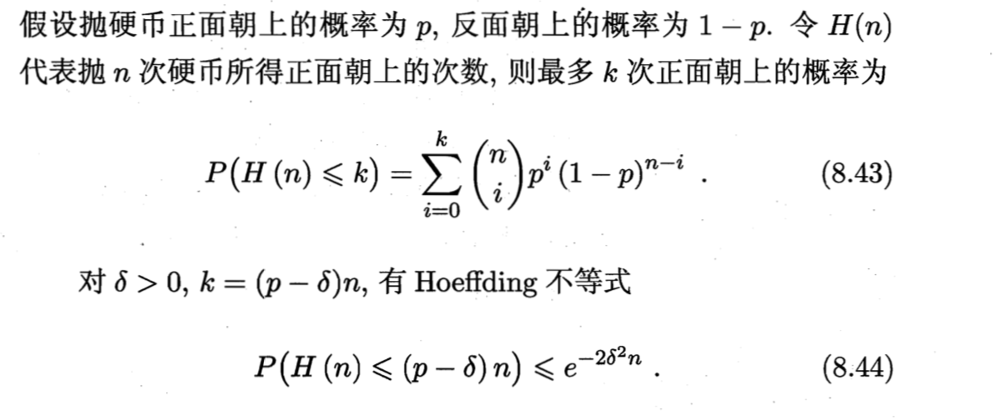
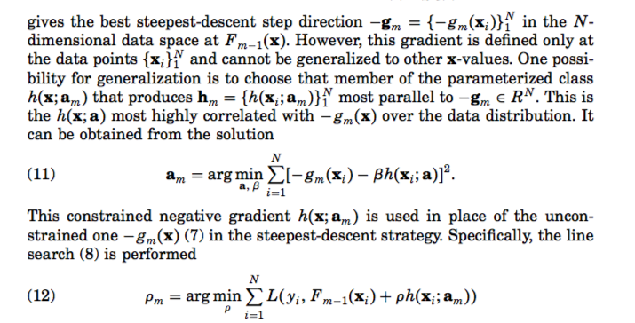
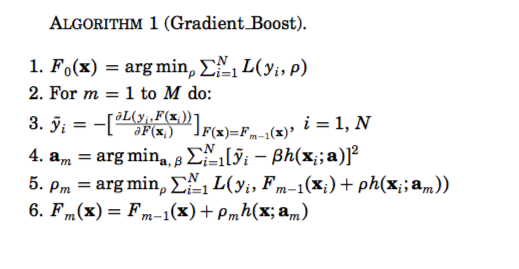
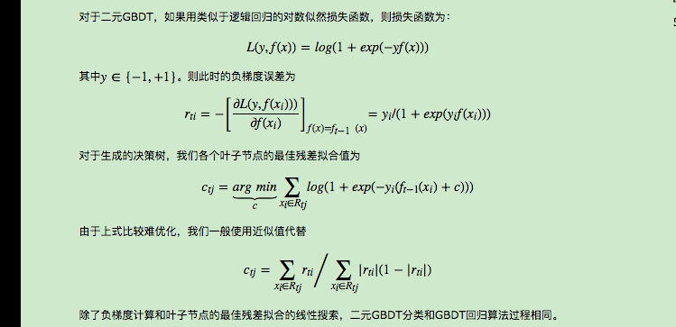
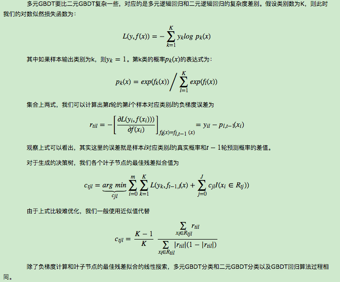

[TOC]

# 决策树

## 特征选择(划分依据)

### 信息增益
+ 信息熵

假设一个样本集合D中有属于多个类别的样本，则当前集合的信息熵，即表示混乱程度：
$$entropy = ent(D) = -\sum_ip_ilogp_i,\mbox{每一个i表示一个类}$$

它的值越小，表示纯度越高。

+ 信息增益:用某一个特征进行分裂后纯度的提升

按照某一个特征进行划分后，信息熵减少的程度;

    信息增益 = D的信息熵 - (D|x)的信息熵

其中D|x在x这个变量下分裂后的条件信息熵为每一个子节点的加权平均(按照样本比例)，则信息增益为：

$$Gain(D,a) = Ent(D)-\sum_{v=1}^V\frac{D^v}{D}Ent(D^v)$$

+ 例子：ID3

### 信息增益比

+ 信息增益的缺点： 倾向于选择取数数目较多的属性。

倘若使用编号进行分裂，每一个节点，一个样本，信息增益肯定非常大，但是这个决策树不具有泛化能力。

+ 信息增益比
  $$Gain_{ratio}(D,a)=\frac{Gain(D,a)}{IV(a)}$$
  其中$$IV(a)=-\sum_{v=1}^V\frac{|D^v|}{|D|}log\frac{|D^v|}{|D|}$$
  称为属性a的固有值，a的可能取值越多，则IV(a)的值通常会越大。

+ 缺点：增益率对取数数目较少的属性有所偏好。

+ 例子：C4.5(==非直接用信息增益率，用了一个启发式的方法，先找到信息增益高于平均水平的属性，再从中选择增益率最高的==)

### 基尼指数

CART中的划分规则

$$Gini(D)=1-\sum_{k=1}^{|y|}p_k^2$$
Gini系数反应了类别标记不一致的概率，因此越小表示数据集D的纯度越高。
属性a的基尼指数定义为：
$$Gini(D,a)=\sum_{v=1}^V\frac{|D^v|}{|D|}Gini(D^v)$$

每次选取使得gini指数最小的，作为最优划分属性。

## 决策树的生成(深度优先)
流程：

```
输入：训练数据D，特征集A，阈值e
输出：决策树T

1. if D中所有样本属于同一类别C then 将node标记为C类叶节点, return T
2. if A是空集，或者D中样本在A上取值都相同，则node标记为叶节点，类别标记为D中样本数最多的类，return T
3. 否则，选择最优划分属性a
4.如果信息增益少于阈值e，置其为单节点；否则，按照属性a进行划分
5.剔除属性a之后，对子树递归调用1-4
```

## 决策树剪枝

+ 预剪枝：在生成过程中，每次进行评价看是否能带来泛化性能的提升，不行就停止划分并将当前结点标记为叶节点。
  + 缺点：当前分裂虽然可能导致泛化能力下降，但之后的后续划分可能导致性能显著提高。
+ 后剪枝：生成完后再剪枝，向上搜索看以某一个内部结点为叶节点的子树是不是有更好的泛化能力。
  + 优点：欠拟合风险较小
  + 缺点：在生成完之后再进行，时间等开销比较大

### 损失函数
设树的叶结点个数为|T|,t是树T的叶结点，该叶结点有$N_t$个样本点，其中k类的样本点有$N_{tk}$，$H_t(T)$为叶节点t上的经验熵
$$C_{\alpha}(T)=\sum_{t=1}^{|T|}N_tH_t(T)+\alpha|T|$$

从叶结点出发，往上面搜寻，若剪枝能带来损失函数的降低，则剪枝。

### CART剪枝

+ 剪枝，形成一个子树序列
  从整体树$T_0$进行剪枝，对$T_0$的任意内部结点t，以t为单节点的损失函数为:
  $$C_{\alpha}(t)=C(t)+\alpha$$
  以t为根节点的子树$T_t$的损失函数为:
  $$C_{\alpha}(T_t)=C(T_t)+\alpha|T_t|$$

随着 $\alpha$的增大，临界点处，$T_t$与t的损失函数相当，因此需要对$T_t$进行剪枝


for t in $T_0$的所有内部结点:

   计算 $g(t)=\frac{C(t)-C(T_t)}{|T_t|-1}$
求出$g(t)$最小，即最小的一个$\alpha$，$T_0$减去最小的$T_t$，得到的树变为$T_1$，$\alpha_1=g(t)$;$T_1$是区间$[\alpha_1,\alpha_2)$的最优子树。

+ 从这些子树序列中，交叉验证得到最优子树$T_{\alpha}$

上面产生的子树序列，交叉验证得到最优的子树。


## 连续值(离散化)
如C4.5一样，使用二分法将其离散化,由于$[a_i,a_{i+1}]$区间内的任何一个划分点不影响结果，因此划分点一般是两个样本点的中位点。

选取最优的划分点(训练样本两个值的中点)，最优的属性

==注意：连续属性作为划分准则时，后代结点仍然可以使用该属性进行划分(可能划分分界点不一样了)==

## 缺失值处理
见周志华(P86):


## 多变量决策树
特征对应于一个维度，多个特征其实就决定了高维空间中的分类边界，值得注意的是，这些分类边界都是轴平行的。如何使得分类边界是曲线的呢？

多变量决策树，也称作斜划分。每个非叶结点，都是形如 $\sum_i w_ia_i=t$的线性分类器。

每一步的划分中，都试图建立一个属性的线性组合来建立合适的线性分类器。


# GBDT

## 想法

每个个体学习器有着不差的效果，同时之间存在多样性。好而不同

+ 假设：==弱分类器（准确率>0.5）, 各分类器之间独立==
+ Hoeffding不等式，随着分类器数目T增大，集成的错误率将指数级下降

$$
假设基分类器的错误率为\epsilon，二分类的Label分别是+1,-1,则只需要有半数的基分类器分类正确就分类正确:\\
H(x)=sign(\sum_{i=1}^T h_i(x))，\ T表示分类器的个数
\\因此，集成学习的错误率为\\
\begin{align}
P(H(x)\neq f(x)) &= P(H(x) \leq [\frac T 2])\\
&=\sum_{i=0}^{|\frac T 2|}C_T^i (1-\epsilon)^i \epsilon^{T-i}\\
\end{align}
$$

此处证明需要使用Hoeffding不等式，


$$
根据上述Hoeffding不等式，p=1-\epsilon,k=[\frac T 2],\ 则 \delta= 1-\epsilon -\frac 1 T [\frac T 2]\\
显然有\delta \geq 1-\epsilon-\frac 1 2 
\\
\begin{align}
P(H(x)\neq f(x)) & = \sum_{i=0}^{|\frac T 2|}C_T^i (1-\epsilon)^i \epsilon^{T-i}\\
& \leq e^{-2\delta^2 T} \leq e^{-2(\frac{1}{2}-\epsilon)^2 T}=e^{-1}(1-2\epsilon)^2 T\\
& \rightarrow 0
\end{align}
$$
随着T的不断增大，集成的错误率将会指数级下降，最终趋向于0(此处假设了基学习器之间相互独立)

+ 流派：
  + 强依赖关系：串行生成的序列化方法，boosting
  + 各个分类器之间弱相关：随机森林


## Boosting

### 思想概览

boosting模型其实可以理解为additive model，
$$
f(x) = \sum_{i=1}^M\beta_mb(x;\gamma_m)
$$
整个大的流程:

> 1. 初始化 $f_0(x)=0$
>
> 2. for m=1 to M:
>
>    (a) 求解 $$(\beta_m,\gamma_m)=arg \ \underset{\beta,\gamma}{min}\sum_{i=1}^NL(y_i, f_{m-1}(x)+\beta b(x_i;\gamma))$$
>
>    (b) 令$f_m = f_{m-1}+\beta_mb(x_i,\gamma_m)$

在上述过程中，实质上是第m次训练时，求得最小化损失函数的参数$\beta,\gamma$后，在之后的add过程中不再对之前的参数进行更新。也就是所谓的前向学习策略  Forward Stagewise Additive modeling)。

### Adaboost

AdaBoost其实是损失函数为指数损失函数时，采取前向学习策略的情况。


#### 原理推导

损失函数为$$L(y,f(x))=exp(-yf(x))$$.AdaBoost分类时，基学习器$G_m(x)\in \{-1,1\}$，有
$$
(\beta_m,G_m)=arg\ \underset{\beta,G}{min} \sum_{i=1}^N exp(-y_i(f_{m-1}(x)+\beta G(x_i)))\\
\mbox{化简有} \ (\beta_m,G_m)=arg\ \underset{\beta,G}{min} \sum_{i=1}^N \omega_i^{(m)}exp(-\beta y_iG(x_i))\\
其中,\omega_i^{(m)}=exp(-y_if_{m-1}(x_i))，这一部分是与参数无关的；
$$


为了求解上面的损失函数最小化，可以分为两步，对于任意$\beta>0$，求解最优的$G(x)$：
$$
L = e^{-\beta}\cdot \sum_{y_i=G(x_i)}\omega_i^{(m)}+e^{\beta}\cdot \sum_{y_i\neq G(x_i)}\omega_i^{(m)}\\
\rightarrow L= (e^{\beta}-e^{-\beta})\sum_{i=1}^N \omega_i^{(m)}I(y_i\neq G(x_i))+e^{-\beta}\sum_{i=1}^N \omega_i^{(m)}
\\
由于上式右边与G无关，因此，G_m = arg \ \underset{G}{min}\sum_i \omega_i^{(m)}I(y_i\neq G(x_i))
$$
对于上式损失函数求偏导数，求解得到最优的$\beta_m$，有
$$
\beta_m = \frac 1 2 log \frac{1-err_m}{err_m}，其中\\
err_m = \frac{\sum_i \omega_i^{(m)}I(y_i\neq G_m(x_i))}{\sum_i\omega_i^{(m)}}
$$
根据上述更新过程，则有
$$
f_m(x)=f_{m-1}(x)+\beta_mG_m(x)\\
则下一次迭代，权重发生变化\ \omega_i^{(m+1)}=\omega_i^{(m)}\cdot e^{-\beta_m y_i G_m(x_i)}
$$
$-y_iG_m(x_i)=2\cdot I(y_i\neq G_m(x_i))-1$，因此有
$$
\omega_i^{(m+1)}=\omega_i^{(m)}\cdot e^{-\beta_m }\cdot e^{\alpha_mI(y_i\neq G_m(x_i))} \ 其中\alpha_m = 2\beta_m
$$


#### 为什么使用指数损失

1. [Frideman et, al. 2000]证明:

$$
f^*(x)=arg \underset{f(x)}{min}E_{Y|X}(e^{-Yf(x)})=\frac 1 2log \frac{P(Y=1|X)}{P(Y=0|X)}\\
则P(Y=1|X) = \frac{1}{1+e^{-2f^*(x)}}
$$

因此可以看出Adaboost估计了比值比的一半。$sign(f(x))$自然而然可以作为分类准则。

2. 从二项分布的损失函数角度

$$
令p(x) = P(Y=1|X)=\frac{e^{f(x)}}{e^{-f(x)}+e^{f(x)}} = \frac{1}{1+e^{-2f(x)}}
$$

则$Y^{'}=\frac{Y+1}{2}\in \{0,1\}$,因此二元似然损失函数为:
$$
l(Y,p(x))=Y^{'}logp(x)+(1-Y^{'})log(1-p(x))\\
或者使用cross-entropy -l(Y,f(x))=log(1+e^{-2Yf(x)})
$$
这个似然函数在$p(x)$处时最大。因此这两种方式得出的解相同。

3. 二分类问题上可以达到贝叶斯最优分类

+ 在AdaBoost中每一次误分类的样本的权值将会被放大$\frac{e_m}{1-e_m}$

#### AdaBoost的推广，以及AdaBoost能不能做多分类问题

+ AdaBoost M1
+ AdaBoost SAMME
+ real AdaBoost：输出概率

### GBDT

#### 思路

+ 对于一颗树，用数学公式的形式表示是:

$$
T(x;\Theta)=\sum_{j=1}^{N}\gamma_jI(x\in R_j)\\
其中R_j表示某一个叶节点，\gamma_j表示一个常数\\
每一步优化，\hat \Theta = arg \underset{\Theta}{min}\sum_{j=1}^J\sum_{x_i\in R_j}L(y_i, \gamma_j)
$$
对于boost tree模型来说，本身boosting是一种思想，但此处可加模型中每一个基分类器是一个树。即每次训练是最优化一个基函数
$$
f_M(x)=\sum_{m=1}^MT(x;\Theta_m)，\\
每一步\Theta_m=arg\underset{\Theta_m}{min}\sum_{i=1}^NL(y_i, f_{m-1}(x_i)+T(x_i;\Theta_m))
$$
对于梯度提升树，$L(f)=\sum_{i=1}^N L(y_i, f(x_i))$在$f_{m-1}$处的梯度是:
$$
g_{im}=[\frac{\partial L(y_i,f(x_i))}{\partial f(x_i)}]_{f(x_i)=f_{m-1}(x_i)}\\
每一步迭代时, f_m=f_{m-1}-\rho_mg_{m}\\
同时每一步的步长 \rho_m=arg \underset{\rho}{min}L(f_{m-1}-\rho_mg_m)
$$

+ 在梯度提升树的过程中，实质上每次对残差在进行一个树的拟合

  在迭代过程中，为了尽量避免过拟合，实际上会在第m步，使得预测值$t_m$与负梯度尽可能地近，即一个损失函数最小，对于平方损失来说:
  $$
  \hat \Theta_m = arg \underset{\Theta}{min}\sum_{i=1}^N (-g_{im}-T(x_i;\Theta))^2
  $$


特殊地，对于回归树中的平方损失，此处梯度:
$$
-g_{im}=y_i-f_{m-1}(x_i)
$$
因此==相当于每次对残差进行一个树拟合==


#### 为什么DT是在拟合负梯度

1. 此处应该考虑从泰勒展开的角度来证明，对于平方损失函数的条件下

$$
L = \sum_{i=1}^N(y_i-f_{m-1}(x_i)-f_m(x_i))^2\\
-g_{im}=y_i-f_{m-1}(x_i) \ 负梯度恰好是残差
$$

考虑泰勒展开:
$$
f(x+\Delta x)\approx f(x)+f^{'}(x)\Delta x+\frac{1}{2}f^{''}(x)\Delta x^2\\
则L(f_{m-1}+f_m)=f_{m-1}+gf_m+\frac{1}{2}hf_{m}^2\\
此处g为一阶导数，h为二阶导数,因此每一步其实最小化的是后面的导数项
$$
而要使得式子最小化，$f_m$实质上是一棵树，而当损失函数为平方损失时，此处树模型实际上在近似负梯度。


2. [Frideman 2001]原文中指出，机器学习目标是最小化期望损失函数，然而在训练时只有训练集的数据，一个解决泛化性能的方式是，最小化基函数与负梯度之间的均方损失:

   

此处也就是说先用基函数去拟合负梯度。这样GBDT的流程如下:



其实logistic 模型也是Gradient boosting模型的一种。


#### GBDT分类树





#### 正则化

在GBDT的建模过程中，决策树的结点数目一般也不能太大，即树的深度不能太大。

同时迭代次数M也不能过大。


+ shrinkage：

  一个简单的方式就是给每一步迭代的模型一个scale，给每一步一个类似学习率的参数v:
  $$
  f_m(x)=f_{m-1}(x)+v\cdot\sum_{j=1}^J\gamma_{jm}I(x\in R_{jm})
  $$


越小的v意味着需要更多的迭代次数，同时v较小使得test error可能较小。实践中可能令v很小，M很大，在迭代时候采用early-stop的方式。


+ subsampling

  GBDT也可以在每次迭代过程中只选取一部分子样本来训练，这不仅减少运算时间，同样可以获得较好的效果。
  
  使用了子采样的称为sgbdt，可以通过采样把数据分发到不同任务去做并行。
  
+ 对弱分类器cart进行剪枝

#### gbdt是否一定是cart

不一定是cart，原则上只要是弱分类器即可，甚至于可以是lr，svm。

#### 参数

+ loss: ls,lad,huber,quantile

+ Learning_rate

+ n_estimator

+ Subsample : 子抽样的比例

+ criterion: split的时候的标准，默认是friedman_mse

  也可以使用mse，mae

+ min_sample_split,min_samples_leaf,max_depth等

+ max_features:用来split的feature个数，auto，sqrt，log等

+ n_iter_no_change:确定是否early-stop的轮数

