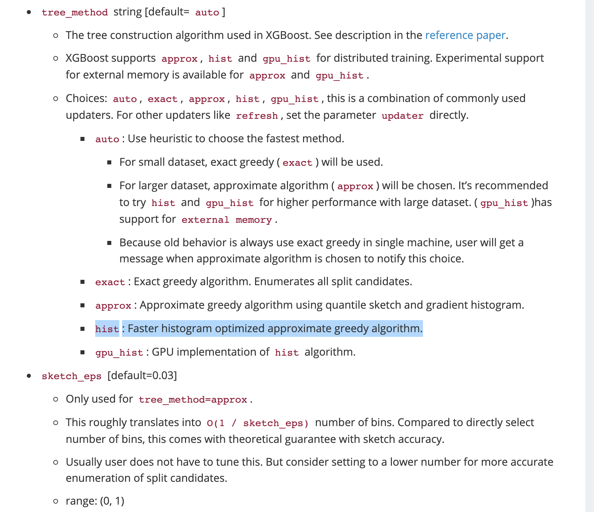
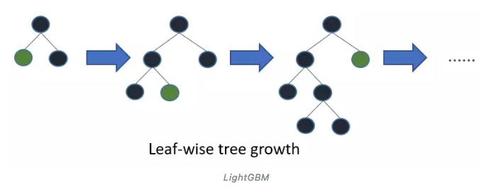
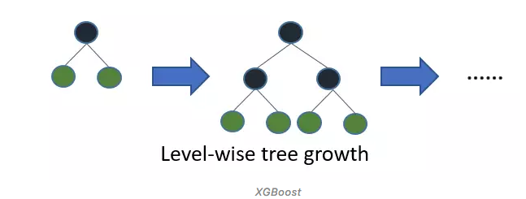
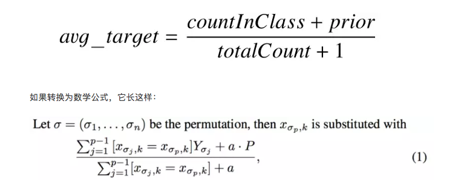
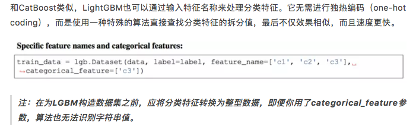
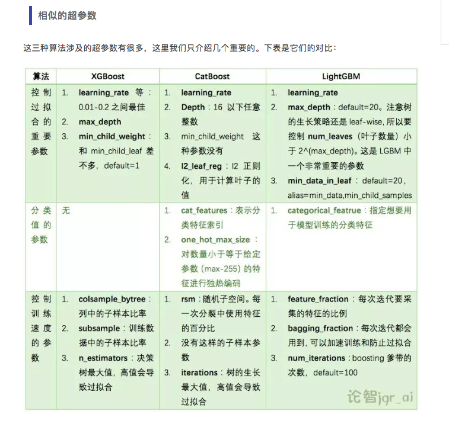

[TOC]

# XGboost

xgboost支持自定义损失函数，因为使用一阶导数和二阶导数，相比较于GBDT更加灵活

## 原理

#### 处理不平衡数据集时

For common cases such as ads clickthrough log, the dataset is extremely imbalanced. This can affect the training of XGBoost model, and there are two ways to improve it.

+ If you care only about the overall performance metric (AUC) of your prediction
  + Balance the positive and negative weights via `scale_pos_weight`
  + Use AUC for evaluation
+ If you care about predicting the right probability
  + In such a case, you cannot re-balance the dataset
  + Set parameter `max_delta_step` to a finite number (say 1) to help convergence

关于一些细节:

建树的时候，是使用hist还是greedy，还是approx

## 与GBDT的一些区别

Xgboost基于Gradient Boosting进行优化，

+ 防止过拟合阶段：正则项、shrinkage 系数，列抽样（借鉴随机森林）
+ 结点分裂时，对于exact greedy split这种复杂度高的算法，采用了一些近似的方法（local quantile variants 和 global quantile variants）;
  + 对于单机非分布，使用exact greedy split，分布式的情况使用近似方法。
  + 对于weighted datasets，采用了weighted quantile sketch的方法
+ 对稀疏性较高数据的处理，将缺失值分给某一个结点(搜寻最优)
+ 在处理时，采用列式压缩存储，同时分多个block，之后搜寻split的点，支持分布式，且对于数据先做好sort之后，之后的quantile finding过程就是线性复杂度的了。
+ cache-aware access
+ blocks for out-of-core computation

## Catboost，lightgbm

### lightgbm和xgboost的结构差异

+ lightgbm采用leaf-wise生长策略，也就是基于梯度的单侧采样（GOSS）来找出用于分裂的数据实例，当增长到相同的叶子节点时，LGBM会直接找出分裂增益最大的叶子（通常是数据最大坨的那个），只分裂一个。

+ 而XGBoost采用的则是level（depth）-wise生长策略，它用预排序算法+直方图算法为每一层的叶子找出最佳分裂，简而言之，就是它是不加区分地分裂同一层所有叶子。（==我理解是，由于XGBoost是基于CART，所以是每次分裂两个==）

+ xgboost 在搜寻最优分裂点时，相较于exact split考虑使用近似方法，但是速度还是慢于GOSS；
+ ==GOSS==：

> GOSS保留了所有具有大梯度的数据点，并对梯度小的数据点进行随机采样。例如，假设我有50万行数据，其中1万行梯度高，剩下的49万行梯度低，那我的算法就会选择1万行+49万行×x%（随机）。设x=10，最终算法选出的就是50万行数据中的5.9万行。
>
> *这里存在一个基本假设，即梯度较小的数据点具有更低的误差，而且已经训练好了*
>
> 为了保持相同的数据分布，在计算分裂增益时，GOSS会为这些梯度小的数据点引入一个常数乘数。以上就是它能在减少数据点数量和保证决策树准确性之间取得平衡的方法。

### 处理类别变量时的差别

+ catboost:

  较为灵活，它可以用在各种统计上的分类特征和数值特征的组合将分类值编码成数字（`one_hot_max_size`：如果feature包含的不同值的数目超过了指定值，将feature转化为float）。

  如果你没有在`cat_features`语句中传递任何内容，CatBoost会把所有列视为数值变量。

  > 注：如果在cat_features中未提供具有字符串值的列，CatBoost会报错。此外，具有默认int类型的列在默认情况下也会被视为数字，所以你要提前手动定义。

对于分类值大于`one_hot_max_size`的那些分类变量，CatBoost也有一种有效的方法。它和均值编码类似，但可以防止过拟合：

+ 对输入样本重新排序，并生成多个随机排列；
+ 将label值从浮点或类别转换为整型；
+ 用以下公式把所有分类特征值转换为数值，其中**CountInClass**表示截至当前样本，label值=1的次数（相同样本总数）；**Prior**表示平滑因子，它由起始参数确定；而**TotalCount**则代表截至当前样本，所有样本的总数

+ lightgbm

+ XGboost: 

  无法单独处理类别特征，需要进行编码

  

  