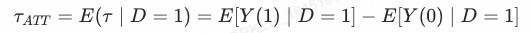
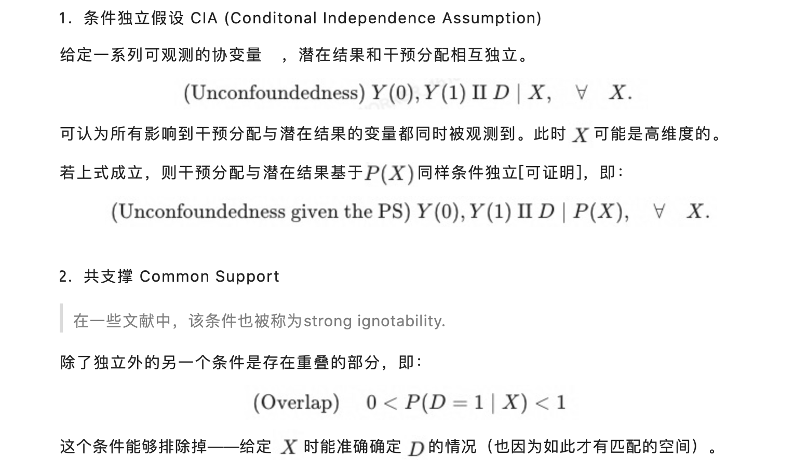

# 因果推断

## 1. 假设

### 1.1 SUTVA

**稳定性假设**: 通常简写为SUTVA(stable unit treatment value assumption)，它的假设内容有两个：

1. 个体间不存在交叉的处理效应，即个体的处理效应不取决于其他个体的处理情况。在此例中，这代表着别人吃不吃药，对于我的头痛程度不会造成影响。(infrence)
2. 所有个体都受到同样程度的处理程度。在这个例子中，我们可以用所有个体都吃了相同数目的药片来指代。不存在药效不一样的药片

**分配机制：**

实际的treatment并不等于样本估计量，而是带有一个bias，这里的bias表示 对照组和处理组在都不接受处理时存在着系统性差异 ，称之为选择偏误

例如：

+ 接受治疗的都是老人身体不好的人（新冠死亡？）
+ 吃头疼药的都是已经头疼的人

对于分配机制有三个基本限制：

1. 个体独立性(individualistic assignment)：任意个体得到处理的概率不依赖于其他个体的协变量与潜在结果。
2. 概率规范性(probabilistic assignment)：个体得到处理的概率严格大于0，小于1。
3. 非混淆性(unconfounded assignment)：分配机制独立于潜在结果

**Ignorability**

假设对于 pre-treatment 变量 X一样的人群, 是否接受处理和潜在结果相互独立

也叫 no unmeasured confounders assumption， Conditional Independence Assumption (CIA)。

**Consistency**

假设潜在结果和观察到的结果是一致的，即当 T=t*T*=*t* 时 Y=Y_t*Y*=*Yt*。这个假设一般可以认为是成立的。

**Positivity**

随机试验：利用随机抽样，减少偏差

双边市场设计下的实验的挑战：

+ 竞争效应：不满足SUTVA，当实验组销售额增加时，势必会减少🍰，导致控制组有所下降；
+ 实验功效不足: 双边市场下买卖双方的样本大小差异明显，广告市场的广告主数量远小于消费者数量。这导致功效不稳定

`treatment effect`: 施加与不施加试验结果的差异。但一个人只要施加treatment，就无法观察到不施加treatment的结果

ATT (average treatment effects on the treated)

ATE(average treatment effect): 等价于 ATT + 选择偏差。此处选择偏差，表示样本在接受或者不接受treatment时，存在着系统性差异。为了使得ATT=ATE，一个思路是消除选择偏差。即本身样本有不同概率被干预，去寻找真正底层的协变量，预测出是否参与treatment。

倾向性得分：用户受到干预的概率 $p(x)=p(D=1|X)$

（1）倾向得分的预测：常见的二分类问题

特征选择：

+ 同时影响干预分配和结果的变量应该被包括（使CIA成立）

+ 被干预项影响的变量应该排除（变量需要在干预项前计算）

（2）匹配算法

基于倾向性得分，为每个被干预的样本匹配一个(或者多个)虚拟的对照样本 （距离最近)

（3） 匹配质量检验

+ 标准化均值的偏差（deviation of scale-diff-mean) :$\frac{|\bar x_c - \bar x_t|}{\sqrt((\delta_t^2+\delta_c^2)/2)}$
+ t检验

+ 联合显著性（伪R^2)
+ QQ plot