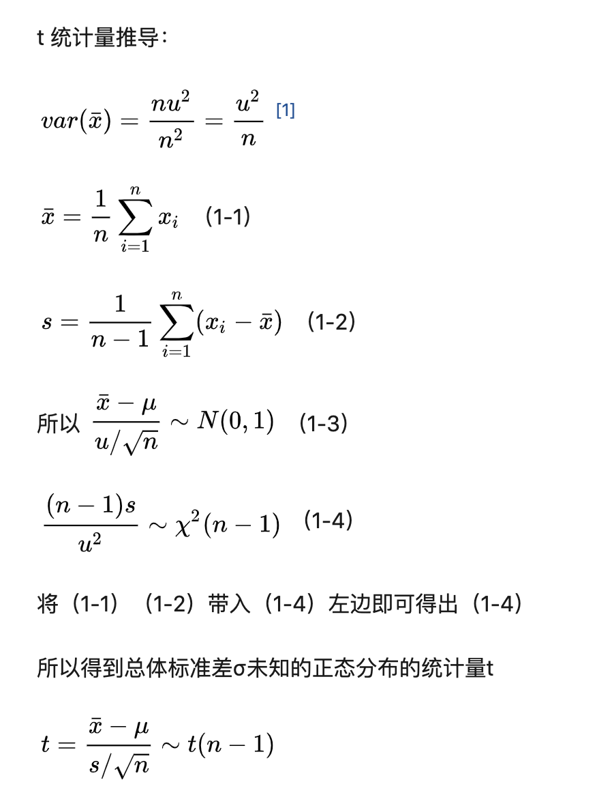
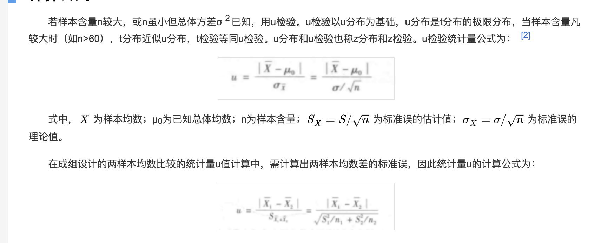
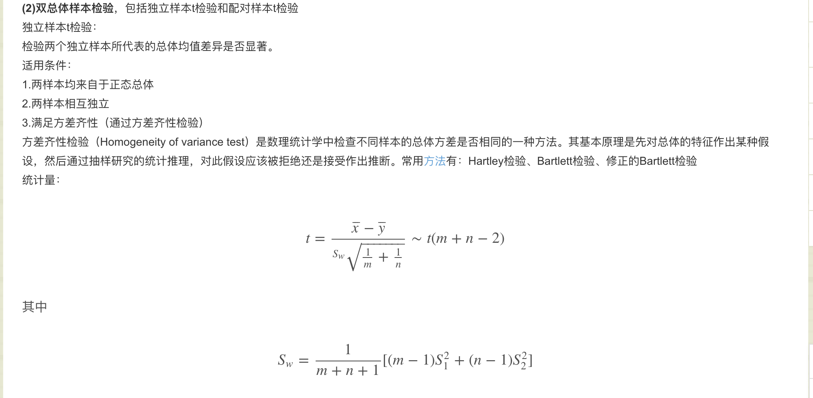
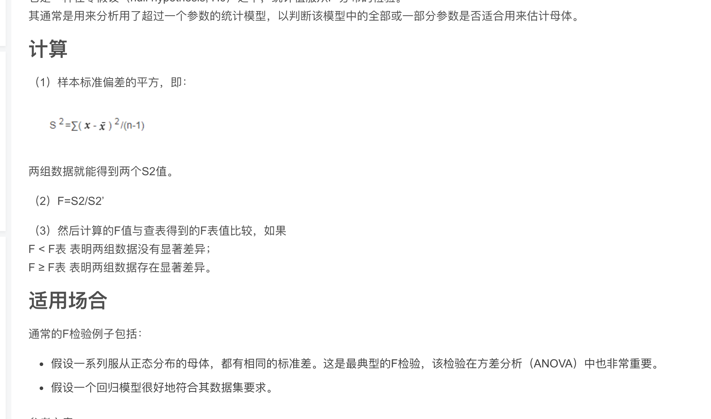

[toc]

# 统计检验

 几大常用检验方法与比较

    1）两样本均值：t检验（样本量少）、u检验（样本量大）
    
    2）多样本均值：F检验（方差齐性检验）、方差分析
    
    3）两样本事件发生频数是否关联：卡方检验、秩和检验（有序多组多分类）、二项分布检验
    
    4）序列自相关：DW检验、ADF检验
    
    5）面板数据检验：F检验、H检验
    
    6）相关性分析、回归分析这些算么？
t检验：样本量较少，满足正态分布，标准差未知。方差齐性

u检验：

u检验是一种用来评估两个独立的顺序数据样本是否来自同一个总体的非参数检验。使用u检验，首先需要将两个独立样本的分数转化为其所在合并样本中的名次（顺序数据），然后检验基于两样本名次计算出的u值，以此来评估两组的平均名次间是否具有显著差异。

双总体t检验

F检验：方差齐性检验

通常的F检验例子包括：

+ 假设一系列服从[正态分布](https://baike.baidu.com/item/正态分布)的母体，都有相同的[标准差](https://baike.baidu.com/item/标准差)。这是最典型的F检验，该检验在[方差分析](https://baike.baidu.com/item/方差分析)（ANOVA）中也非常重要。
+ 假设一个回归模型很好地符合其[数据集](https://baike.baidu.com/item/数据集)要求，检验多元线性回归模型中被解释变量与解释变量之间线性关系在总体上是否显著。

卡方检验：

拟合优度检验：

拟合优度检验是用[卡方统计量](https://baike.baidu.com/item/卡方统计量/22099074)进行统计[显著性检验](https://baike.baidu.com/item/显著性检验)的重要内容之一。它是依据总体分布状况，计算出[分类变量](https://baike.baidu.com/item/分类变量/7979433)中各类别的期望频数，与分布的观察频数进行对比，判断期望频数与观察频数是否有显著差异，从而达到从分类变量进行分析的目的。

### 相关性检验

#### 连续型变量

#### 离散型变量

## 参考资料

https://blog.csdn.net/u013382288/article/details/80470316