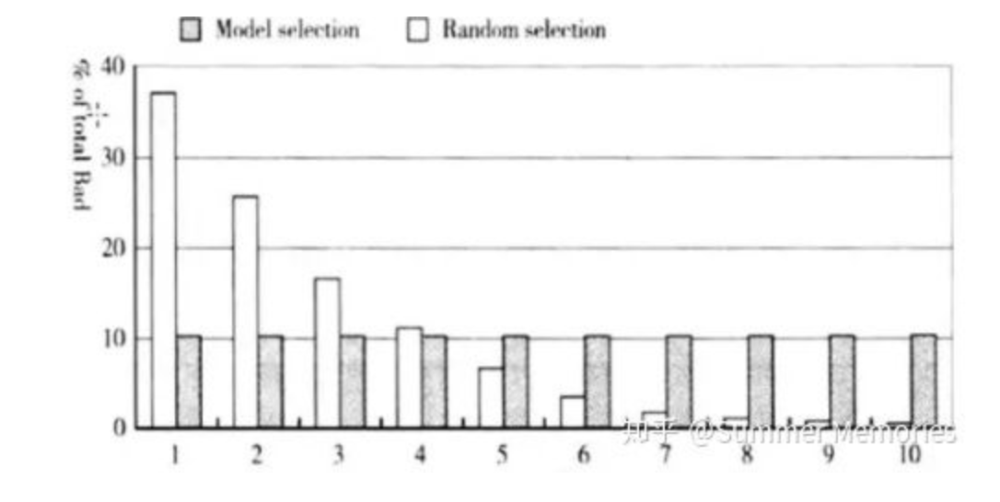
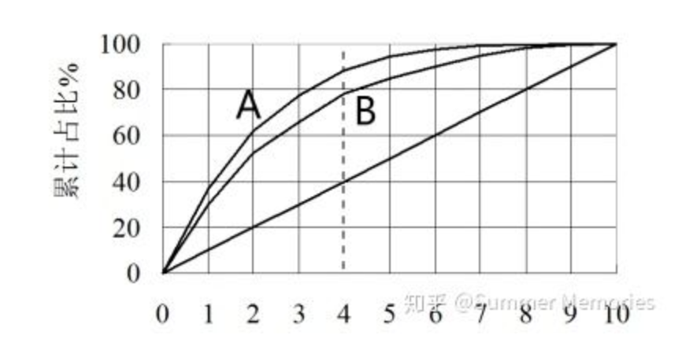
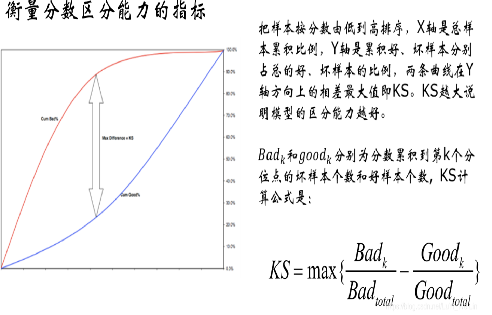

[toc]

## 1. 基本概念

信用违约风险的指标:

+ PD(probability of default)违约概率:借款人在未来一定时期内发生违约的可能性。
+ LGD(Loss Given Default)违约条件下的损失率:即违约发生时风险暴露的损失程度,从贷款回收的角度看,违约损失率决定了贷款回收的程度,违约损失率=1-回收率(Recovery Rate)。
+ EAD(Exposure At Defaul)违约风险下的敞口暴露：是指债务人违约时的预期表内表外项目暴露总和。
+ RWA(risk-weighted assets) 风险加重资产：是指对银行的资产加以分类，根据不同类别资产的风险性质确定不同的风险权重，以这种风险系数为权重求得的资产。
+ EL(Expected Loss)期望损失:期望损失是银行从事业务所产生的平均损失。它可以通过对银行损失的历史数据统计得出。

M0,M1,M2的定义：

+ M0：最后缴款日的第二天到下一个账单日
+ M1:M0时段的延续，即在未还款的第二个账单日的最后缴款日期之间
+ M2:M1的延续，即在未还款的第三个账单日到第三次账单的最后缴款日之间

## 2. 评分卡种类

### 申请评分卡(A卡)

特征

### 行为评分卡(B卡)

#### 定义

贷中，根据放贷后的表现行为，预测未来逾期/违约概率的模型。适用于还款周期长的信贷产品

在建模的时候，对于label的窗口长度，与提取特征的窗口长度都有一定要求:

行为评分卡预测的是条件概率: $p(\frac{未来一段时间内发生违约}{当前没有违约})$

####  特征

+ 时间切片: 过去某段时间跨度的特征，比如观察期内消费金额、平均值等

+ 还款率：本月还款额/上月末总欠款额，过去半年最大(小)月还款率，过去半年平均月还款率

+ 额度使用情况：对于使用额度较多的账户，未来还款压力较大，相对容易引发违约。同时使用额度也会受到授信总额的影响，需要将使用额度转换成使用率:

  $$额度使用率=\frac{本月使用额度}{授信总额度}$$

过去六个月平均额度使用率、过去六个月月额度使用率升高的月份数

+ 逾期类型的特征

  过去六个月的最大逾期状态；过去六个月M1,M2,M3（逾期几个月）的次数

+ 消费类型的特征

国外消费、提现、线上消费

+ 三方机构（社交数据、出行数据）

#### 模型建议步骤

+ 数据预处理
+ 特征构造
+ 特征处理与筛选:
  + IV 值
  + WOE编码后，俩俩共线性不能太高
  + WOE编码后，方差膨胀因子VIF不能太高
  + 变量分箱
  + 单变量逻辑回归的参数估计
  + 特征筛选（有多种方法）
+ 模型性能测试：AUC，KS

### 催收评分卡(C卡)

## 3.模型评价

### 提升图与洛伦兹曲线

如果目前有10000个样本，坏用户占比为30%，我们做一个评分卡（分数越低，用户坏的概率越高），按照评分从低到高划分为10等份（每个等份用户数为1000），计算每等份坏用户占比，如果评分卡效果够好，那么越靠前的等份里，包含的坏用户应该越多，越靠后的等份里，包含的坏用户应该要更少。作为对比，如果不对用户评分，按照总体坏用户占比30%来算，每个等份中30%，将两种方法的每等份坏用户占比放在一张柱状图上进行对比，就是提升图。

将这两种方法的累积坏用户占比放在一张曲线图上，就是洛伦兹曲线图。洛伦兹曲线，可以比较两个评分卡的优势，

A，B模型虽然在虚线处的cutoff的拒绝率都是40%，但是A都能拒绝掉88%的坏用户，B只能拒绝掉78%的坏用户。

### WOE分析

1）WOE变化趋势
这个趋势变化主要针对连续数值型变量，假设WOE的计算方式是bad/good，某个变量按照业务理解是值越大，坏用户概率越大。那么变量分箱后，WOE的变化趋势应该与实际的业务经验一致，也就是变量的值越大，WOE越大，且呈单调性变化。对于WOE没有呈单调性变化的变量（例如U型或倒U型），如果业务上能解释的通，那也可以采用该变量。WOE呈波浪形变化的变量建议不采用。
PS：在做WOE趋势分析时不考虑缺失的箱体，并且最好将变量分为4-8箱。

2）箱体之间WOE的差异分析
分箱的原则是组内差异小，组间差异大，所以箱体之间的WOE要有显著差异，个人认为WOE的差值至少要在0.1以上，这样每个箱体的好坏比才有区别。另外我觉得WOE最好不要出现跃阶式变化，例如第一个箱体的woe是0.1，下一个箱体WOE直接增大到0.9，这样会导致最后转化的分数也会呈跃阶式变化，这个对总体评分的分布及稳定性会有很大影响。箱体的WOE最好是单调线性变化的。

3）箱体的WOE绝对值大小
箱体的WOE值最好是在-1至1之间，如果WOE的绝对值大于1，说明这个箱体的坏用户占比或者好用户占比在65%以上，这种变量适合做单条策略，如果放到模型中，这个变量的权重可能会很大，会增加模型过拟合的危险，并会影响评分卡的稳定性。

### SCORE分析
score就是每个变量各个区间对应的得分，根据score的计算公式（score=系数xWOEx刻度B），score的值和WOE的关系是很大的，所以和WOE分析类似，score也要分析它的趋势变化，箱体间score的差异，以及score的绝对值大小。分析逻辑与WOE大致相同。这里就不再说明。一般来说WOE的可解释性较好，score应该不会有大问题。

### ROC曲线

横轴FPR,纵轴TPR，ROC曲线是每一个阈值下(FPR,TPR)的组合。AUC：ROC曲线下面积

### KS

评分卡模型的结果需要对好、坏人给出一定的区分度。

KS就是好、坏人群分数（或者违约概率）的分布的差异。

KS>0.3的话模型较好。但KS只能区分最好的分数的区分度，不能衡量其他分数。

### Divergence

相对指标，用来比较两个评分卡模型的好坏。反映好、坏样本分数（或概率）的距离的指标。Divergence越大，两类样本的”距离“越大，差异越大。

$$Divergence = \frac{(\mu_{good}-\mu_{bad})^2}{\frac{1}{2}(var_{good}+var_{bad})}$$  

### Gini

分数或概率段中坏样本浓度的差异

$$Gini = \sum\frac{n_i}{N}(1-p_i^2-(1-p_i)^2)=2\sum\frac{n_i}{N}(1-p_i)p_i$$

### PSI

衡量分数稳定性的指标，通常要求低于25%：针对不同样本，或者不同时间的样本，population分布是否有变化。

可以拿训练集和验证集来作为两组样本

$$PSI=\sum_i(R_i-B_i) \cdot ln(R_i/B_i)$$

### 评分卡的分数如何计算得来

$$
odds = \frac{p}{1-p}
$$

$$
p=\frac{odds}{1+odds}
$$

假设分数为:
$$
Score = A - B\cdot ln(odds)
$$

假设$odds=\theta_0$时的分数为$p_0$,设定当$odds=\theta_0$每增加一倍时，增加的分数PDO(point  of double odds)

则
$$
p_0=A+Bln(\theta_0)
$$

$$
p_0+PDO=A-Bln(2\theta_0)
$$

## 参考资料

https://blog.csdn.net/LuYi_WeiLin/article/details/87907948

https://zhuanlan.zhihu.com/p/56738542